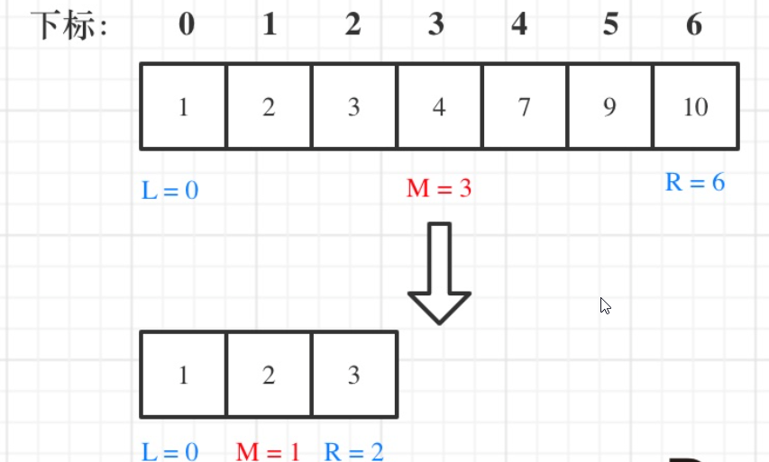
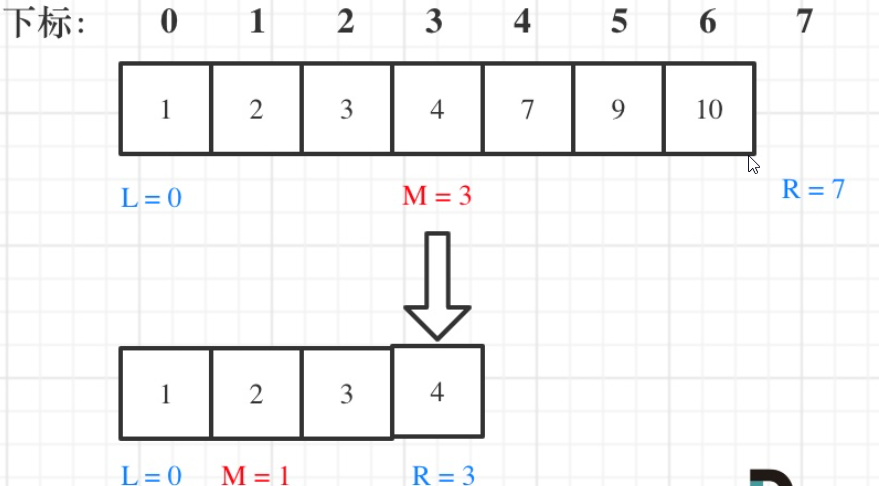
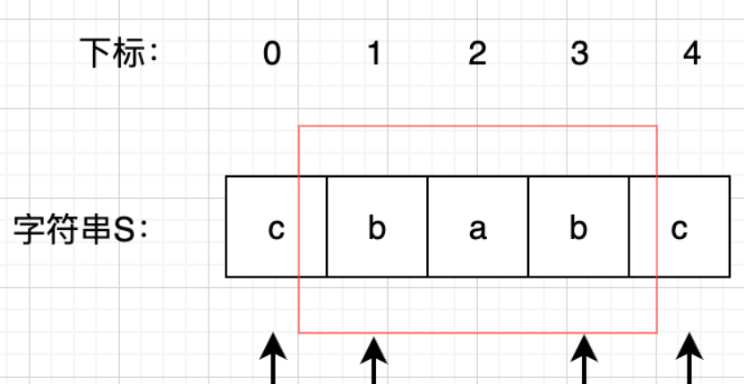
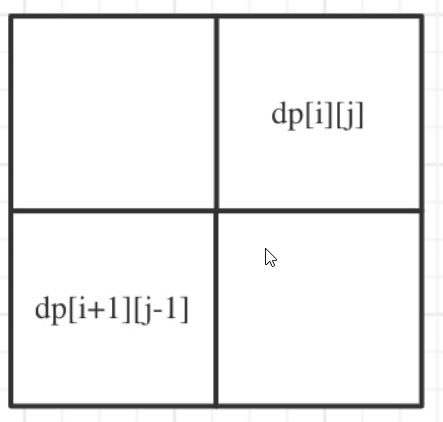
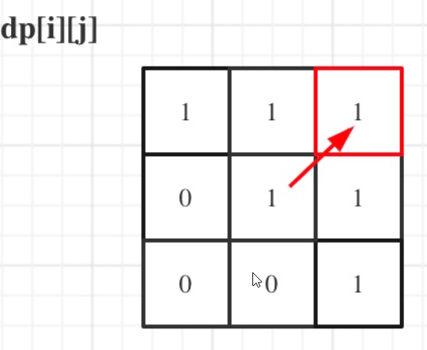

## 字符串

### 1 反转字符串


## 数组

### 1 数组理论基础

数组是非常基础的数据结构，在面试中，考察数组的题目一般在思维上都不难，主要是考察对代码的掌控能力

也就是说，想法很简单，但实现起来 可能就不是那么回事了。

首先要知道数组在内存中的存储方式，这样才能真正理解数组相关的面试题

**数组是存放在连续内存空间上的相同类型数据的集合。**

数组可以方便的通过下标索引的方式获取到下标下对应的数据。

举一个字符数组的例子，如图所示：


需要两点注意的是

- **数组下标都是从0开始的。**
- **数组内存空间的地址是连续的**

正是**因为数组的在内存空间的地址是连续的，所以我们在删除或者增添元素的时候，就难免要移动其他元素的地址。**

例如删除下标为3的元素，需要对下标为3的元素后面的所有元素都要做移动操作，如图所示：


而且大家如果使用C++的话，要注意vector 和 array的区别，vector的底层实现是array，严格来讲vector是容器，不是数组。

**数组的元素是不能删的，只能覆盖。**

那么二维数组直接上图，大家应该就知道怎么回事了


**那么二维数组在内存的空间地址是连续的么？**

不同编程语言的内存管理是不一样的，以C++为例，在C++中二维数组是连续分布的。

我们来做一个实验，C++测试代码如下：

```cpp
void test_arr() {
    int array[2][3] = {
		{0, 1, 2},
		{3, 4, 5}
    };
    cout << &array[0][0] << " " << &array[0][1] << " " << &array[0][2] << endl;
    cout << &array[1][0] << " " << &array[1][1] << " " << &array[1][2] << endl;
}

int main() {
    test_arr();
}
```


测试地址为

```text
0x7ffee4065820 0x7ffee4065824 0x7ffee4065828
0x7ffee406582c 0x7ffee4065830 0x7ffee4065834
```


注意地址为16进制，可以看出二维数组地址是连续一条线的。

一些录友可能看不懂内存地址，我就简单介绍一下， 0x7ffee4065820 与 0x7ffee4065824 差了一个4，就是4个字节，因为这是一个int型的数组，所以两个相邻数组元素地址差4个字节。

0x7ffee4065828 与 0x7ffee406582c 也是差了4个字节，在16进制里8 + 4 = c，c就是12。

如图：


**所以可以看出在C++中二维数组在地址空间上是连续的**。

像Java是没有指针的，同时也不对程序员暴露其元素的地址，寻址操作完全交给虚拟机。

所以看不到每个元素的地址情况，这里我以Java为例，也做一个实验。

```java
public static void test_arr() {
    int[][] arr = {{1, 2, 3}, {3, 4, 5}, {6, 7, 8}, {9,9,9}};
    System.out.println(arr[0]);
    System.out.println(arr[1]);
    System.out.println(arr[2]);
    System.out.println(arr[3]);
}
```


输出的地址为：

```text
[I@7852e922
[I@4e25154f
[I@70dea4e
[I@5c647e05
```


这里的数值也是16进制，这不是真正的地址，而是经过处理过后的数值了，我们也可以看出，二维数组的每一行头结点的地址是没有规则的，更谈不上连续。

所以Java的二维数组可能是如下排列的方式：


### 2 704. 二分查找


给定一个 n 个元素有序的（升序）整型数组 nums 和一个目标值 target  ，写一个函数搜索 nums 中的 target，如果目标值存在返回下标，否则返回 -1。

示例 1:

```text
输入: nums = [-1,0,3,5,9,12], target = 9     
输出: 4       
解释: 9 出现在 nums 中并且下标为 4     
```

示例 2:

```text
输入: nums = [-1,0,3,5,9,12], target = 2     
输出: -1        
解释: 2 不存在 nums 中因此返回 -1        
```

提示：

- 你可以假设 nums 中的所有元素是不重复的。
- n 将在 [1, 10000]之间。
- nums 的每个元素都将在 [-9999, 9999]之间。


#### 思路

**这道题目的前提是数组为有序数组**，同时题目还强调**数组中无重复元素**，因为一旦有重复元素，使用二分查找法返回的元素下标可能不是唯一的，这些都是使用二分法的前提条件，当大家看到题目描述满足如上条件的时候，可要想一想是不是可以用二分法了。

二分查找涉及的很多的边界条件，逻辑比较简单，但就是写不好。例如到底是 `while(left < right)` 还是 `while(left <= right)`，到底是`right = middle`呢，还是要`right = middle - 1`呢？

大家写二分法经常写乱，主要是因为**对区间的定义没有想清楚，区间的定义就是不变量**。要在二分查找的过程中，保持不变量，就是在while寻找中每一次边界的处理都要坚持根据区间的定义来操作，这就是**循环不变量**规则。

写二分法，区间的定义一般为两种，左闭右闭即[left, right]，或者左闭右开即[left, right)。

下面我用这两种区间的定义分别讲解两种不同的二分写法。

#### 二分法第一种写法

第一种写法，我们定义 target 是在一个在左闭右闭的区间里，**也就是[left, right] （这个很重要非常重要）**。

区间的定义这就决定了二分法的代码应该如何写，**因为定义target在[left, right]区间，所以有如下两点：**

- while (left <= right) 要使用 <= ，因为left == right是有意义的，所以使用 <=
- if (nums[middle] > target) right 要赋值为 middle - 1，因为当前这个nums[middle]一定不是target，那么接下来要查找的左区间结束下标位置就是 middle - 1

例如在数组：1,2,3,4,7,9,10中查找元素2，如图所示：



代码如下：（详细注释）

```cpp
// 版本一
class Solution {
public:
    int search(vector<int>& nums, int target) {
        int left = 0;
        int right = nums.size() - 1; // 定义target在左闭右闭的区间里，[left, right]
        while (left <= right) { // 当left==right，区间[left, right]依然有效，所以用 <=
            int middle = left + ((right - left) / 2);// 防止溢出 等同于(left + right)/2
            if (nums[middle] > target) {
                right = middle - 1; // target 在左区间，所以[left, middle - 1]
            } else if (nums[middle] < target) {
                left = middle + 1; // target 在右区间，所以[middle + 1, right]
            } else { // nums[middle] == target
                return middle; // 数组中找到目标值，直接返回下标
            }
        }
        // 未找到目标值
        return -1;
    }
};
```

- 时间复杂度：O(log n)
- 空间复杂度：O(1)

#### 二分法第二种写法

如果说定义 target 是在一个在左闭右开的区间里，也就是[left, right) ，那么二分法的边界处理方式则截然不同。

有如下两点：

- while (left < right)，这里使用 < ,因为left == right在区间[left, right)是没有意义的
- if (nums[middle] > target) right 更新为 middle，因为当前nums[middle]不等于target，去左区间继续寻找，而寻找区间是左闭右开区间，所以right更新为middle，即：下一个查询区间不会去比较nums[middle]

在数组：1,2,3,4,7,9,10中查找元素2，如图所示：（**注意和方法一的区别**）



代码如下：（详细注释）

```cpp
// 版本二
class Solution {
public:
    int search(vector<int>& nums, int target) {
        int left = 0;
        int right = nums.size(); // 定义target在左闭右开的区间里，即：[left, right)
        while (left < right) { // 因为left == right的时候，在[left, right)是无效的空间，所以使用 <
            int middle = left + ((right - left) >> 1);
            if (nums[middle] > target) {
                right = middle; // target 在左区间，在[left, middle)中
            } else if (nums[middle] < target) {
                left = middle + 1; // target 在右区间，在[middle + 1, right)中
            } else { // nums[middle] == target
                return middle; // 数组中找到目标值，直接返回下标
            }
        }
        // 未找到目标值
        return -1;
    }
};
```

- 时间复杂度：O(log n)
- 空间复杂度：O(1)

#### 35.搜索插入位置

给定一个排序数组和一个目标值，在数组中找到目标值，并返回其索引。如果目标值不存在于数组中，返回它将会被按顺序插入的位置。

你可以假设数组中无重复元素。

示例 1:

- 输入: [1,3,5,6], 5
- 输出: 2

示例 2:

- 输入: [1,3,5,6], 2
- 输出: 1

示例 3:

- 输入: [1,3,5,6], 7
- 输出: 4

示例 4:

- 输入: [1,3,5,6], 0
- 输出: 0

```java
public class Solution35 {
    public int searchInsert(int[] nums,int target) {
        int n = nums.length;

        int low = 0;
        int high = n - 1;

        while (low<= high) {
            int mid = low + ((high-low)>>1);
            if (nums[mid] == target)
                return mid;
            else if (nums[mid]<target)
                low = mid + 1;
            else if (nums[mid]>target)
                high = mid -1;
        }

        return high+1;
    }

    public int searchInsert1(int[] nums,int target) {
        int n = nums.length;

        int low = 0;
        int high = n;

        while (low< high) {
            int mid = low + ((high-low)>>1);
            if (nums[mid] == target)
                return mid;
            else if (nums[mid]<target)
                low = mid + 1;
            else if (nums[mid]>target)
                high = mid;
        }

        return high;
    }

    public static void main(String[] args) {
        int [] arr = {1,3,5,7,9};
        System.out.println(new Solution35().searchInsert1(arr, 4));
    }
}
```


#### 34.在排序数组中查找元素的第一个和最后一个位置

给定一个按照升序排列的整数数组 nums，和一个目标值 target。找出给定目标值在数组中的开始位置和结束位置。

如果数组中不存在目标值 target，返回 [-1, -1]。

进阶：你可以设计并实现时间复杂度为 $O(\log n)$ 的算法解决此问题吗？

示例 1：

- 输入：nums = [5,7,7,8,8,10], target = 8
- 输出：[3,4]

示例 2：

- 输入：nums = [5,7,7,8,8,10], target = 6
- 输出：[-1,-1]

示例 3：

- 输入：nums = [], target = 0
- 输出：[-1,-1]


写两个二分，分别查找左右边界

就是分别从右和从左找target，但target有三种情况:

1. 超出范围
2. 在范围内，不存在
3. 只有一个值

既然分别找，就写两个方法作为分别找到之后的索引值

```java
int getRightBorder(int[] nums, int target);
int getLeftBorder(int[] nums, int target);
```


#### 39.x的平方根

给你一个非负整数 `x` ，计算并返回 `x` 的 **算术平方根** 。

由于返回类型是整数，结果只保留 **整数部分** ，小数部分将被 **舍去 。**

**注意：**不允许使用任何内置指数函数和算符，例如 `pow(x, 0.5)` 或者 `x ** 0.5` 。

x = 8 		0	1	2	3	4	5	6	7	8			0	8	4			ans = 4		5	3	return

```java
public int mySqrt(int x) {
    int left = 0;
    int right = x;
    int ans = -1;

    while (left<=right) {
        int mid = left+((right-left)>>1);

        if ((long)mid*mid <=x) {
            ans = mid;
            left = mid+1;
        }else {
            right = mid -1;
        }
    }
    return  ans;
}
```


#### 367.有效的完全平方根

给你一个正整数 `num` 。如果 `num` 是一个完全平方数，则返回 `true` ，否则返回 `false` 。

**完全平方数** 是一个可以写成某个整数的平方的整数。换句话说，它可以写成某个整数和自身的乘积。

不能使用任何内置的库函数，如 `sqrt` 。


8 	0	1	2	3	4	5	6	7	8				0	8	4

```java
public boolean isPerfectSquare(int num) {
    int l = 0;
    int r = num;

    while (l<=r) {
        int mid = l+((r - l)>>1);
        if ((long)mid*mid == num)
            return true;
        else if ((long)mid*mid<num) {
            l = mid+1;
        }else {
            r = mid -1;
        }
    }
    return false;
}
```


### 3 移除元素


给你一个数组 nums 和一个值 val，你需要 原地 移除所有数值等于 val 的元素，并返回移除后数组的新长度。

不要使用额外的数组空间，你必须仅使用 O(1) 额外空间并**原地**修改输入数组。

元素的顺序可以改变。你不需要考虑数组中超出新长度后面的元素。


示例 1: 给定 nums = [3,2,2,3], val = 3, 函数应该返回新的长度 2, 并且 nums 中的前两个元素均为 2。 

示例 2: 给定 nums = [0,1,2,2,3,0,4,2], val = 2, 函数应该返回新的长度 5, 并且 nums 中的前五个元素为 0, 1, 3, 0, 4。


#### 思路

有的同学可能说了，多余的元素，删掉不就得了。

**要知道数组的元素在内存地址中是连续的，不能单独删除数组中的某个元素，只能覆盖。**


#### 暴力解法

q简单

- 现在数组中找到要删除的元素
- 后面的元素依次覆盖前一格

```java
public int removeElement(int[] nums,int val) {
    int n = nums.length;
    for (int i = 0; i < n; i++) {   //遍历数组
        if (nums[i] == val) {       //首先找到的值为val的索引
            for (int j = i+1; j < n; j++) {     //遍历后面的元素，使其向前移动一位
                nums[j-1] = nums[j];
            }
            i--;    //因为覆盖完后，是新的元素，需要重新判断
            n--;    //长度-1 ，尾格位置多余了
        }

    }
    for (int i = 0; i < n; i++) {
        System.out.print(nums[i]+" ");
    }
    return n;
}
```

- 时间复杂度：O(n^2)
- 空间复杂度：O(1)


#### 双指针法

即快慢指针法：**通过一个快指针和慢指针在一个for循环下完成两个for循环的工作。**

- 快指针：寻找新数组的元素 ，新数组就是不含有目标元素的数组
- 慢指针：指向更新 新数组下标的位置

```java
public int removeElement1(int[] nums,int val) {
    int slowIndex = 0;
    for (int fastIndex = 0; fastIndex < nums.length; fastIndex++) {
        if (nums[fastIndex]!=val) {
            nums[slowIndex++] = nums[fastIndex];
        }
    }

    return slowIndex;

}
```


#### 相向双指针法

基于元素顺序可以改变的题目描述改变了元素相对位置，确保了移动最少元素


26.

283.

844.

977.


## 11 动态规划 Dynamic Programming

### 11.1 思路

#### 11.1.1 什么是动态规划

​	动态规划中每一个状态一定是由上一个状态推导出来的，**这一点就区分于贪心**，贪心没有状态推导，而是从局部直接选最优的，

比如背包问题。

例如：有N件物品和一个最多能背重量为W 的背包。第i件物品的重量是weight[i]，得到的价值是value[i] 。**每件物品只能用一次**，求解将哪些物品装入背包里物品价值总和最大。

动态规划中dp[j]是由dp[j-weight[i]]推导出来的，然后取max(dp[j], dp[j - weight[i]] + value[i])。

但如果是贪心呢，每次拿物品选一个最大的或者最小的就完事了，和上一个状态没有关系。

所以贪心解决不了动态规划的问题。

而且很多讲解动态规划的文章都会讲最优子结构啊和重叠子问题啊这些，这些东西都是教科书的上定义，晦涩难懂而且不实用。

大家知道动规是由前一个状态推导出来的，而贪心是局部直接选最优的就够了

#### 11.1.2 动态规划的解题步骤

做动规题目的时候，很多同学会陷入一个误区，就是以为把状态转移公式背下来，照葫芦画瓢改改，就开始写代码，甚至把题目AC之后，都不太清楚dp[i]表示的是什么。

**这就是一种朦胧的状态，然后就把题给过了，遇到稍稍难一点的，可能直接就不会了，然后看题解，然后继续照葫芦画瓢陷入这种恶性循环中**。

状态转移公式（递推公式）是很重要，但动规不仅仅只有递推公式。

**对于动态规划问题，我将拆解为如下五步曲，这五步都搞清楚了，才能说把动态规划真的掌握了！**

1. 确定dp数组（dp table）以及下标的含义
2. 确定递推公式
3. dp数组如何初始化
4. 确定遍历顺序
5. 举例推导dp数组

一些同学可能想为什么要先确定递推公式，然后在考虑初始化呢？

**因为一些情况是递推公式决定了dp数组要如何初始化！**

后面的讲解中我都是围绕着这五点来进行讲解。

可能刷过动态规划题目的同学可能都知道递推公式的重要性，感觉确定了递推公式这道题目就解出来了。

其实 确定递推公式 仅仅是解题里的一步而已！

一些同学知道递推公式，但搞不清楚dp数组应该如何初始化，或者正确的遍历顺序，以至于记下来公式，但写的程序怎么改都通过不了。

后序的讲解的大家就会慢慢感受到这五步的重要性了。

#### 11.1.3 动态规划应该如何debug

相信动规的题目，很大部分同学都是这样做的。

看一下题解，感觉看懂了，然后照葫芦画瓢，如果能正好画对了，万事大吉，一旦要是没通过，就怎么改都通过不了，对 dp数组的初始化，递推公式，遍历顺序，处于一种黑盒的理解状态。

写动规题目，代码出问题很正常！

**找问题的最好方式就是把dp数组打印出来，看看究竟是不是按照自己思路推导的！**

一些同学对于dp的学习是黑盒的状态，就是不清楚dp数组的含义，不懂为什么这么初始化，递推公式背下来了，遍历顺序靠习惯就是这么写的，然后一鼓作气写出代码，如果代码能通过万事大吉，通过不了的话就凭感觉改一改。

这是一个很不好的习惯！

**做动规的题目，写代码之前一定要把状态转移在dp数组的上具体情况模拟一遍，心中有数，确定最后推出的是想要的结果**。

然后再写代码，如果代码没通过就打印dp数组，看看是不是和自己预先推导的哪里不一样。

如果打印出来和自己预先模拟推导是一样的，那么就是自己的递归公式、初始化或者遍历顺序有问题了。

如果和自己预先模拟推导的不一样，那么就是代码实现细节有问题。

**这样才是一个完整的思考过程，而不是一旦代码出问题，就毫无头绪的东改改西改改，最后过不了，或者说是稀里糊涂的过了**。

这也是我为什么在动规五步曲里强调推导dp数组的重要性。

举个例子哈：在「代码随想录」刷题小分队微信群里，一些录友可能代码通过不了，会把代码抛到讨论群里问：我这里代码都已经和题解一模一样了，为什么通过不了呢？

发出这样的问题之前，其实可以自己先思考这三个问题：

- 这道题目我举例推导状态转移公式了么？
- 我打印dp数组的日志了么？
- 打印出来了dp数组和我想的一样么？

**如果这灵魂三问自己都做到了，基本上这道题目也就解决了**，或者更清晰的知道自己究竟是哪一点不明白，是状态转移不明白，还是实现代码不知道该怎么写，还是不理解遍历dp数组的顺序。

然后在问问题，目的性就很强了，群里的小伙伴也可以快速知道提问者的疑惑了。

**注意这里不是说不让大家问问题哈， 而是说问问题之前要有自己的思考，问题要问到点子上！**

**大家工作之后就会发现，特别是大厂，问问题是一个专业活，是的，问问题也要体现出专业！**

如果问同事很不专业的问题，同事们会懒的回答，领导也会认为你缺乏思考能力，这对职场发展是很不利的。

所以大家在刷题的时候，就锻炼自己养成专业提问的好习惯。


### 11.2 刷题


#### 509. 斐波那契数

​	斐波那契数，通常用 F(n) 表示，形成的序列称为 斐波那契数列 。该数列由 0 和 1 开始，后面的每一项数字都是前面两项数字的和。也就是： F(0) = 0，F(1) = 1 F(n) = F(n - 1) + F(n - 2)，其中 n > 1 给你n ，请计算 F(n) 。


##### 思路

动规五部曲


##### 解法

###### 动态规划

动规五部曲：

这里我们要用一个一维dp数组来保存递归的结果

1. 确定dp数组以及下标的含义

dp[i]的定义为：第i个数的斐波那契数值是dp[i]

​	2.确定递推公式

为什么这是一道非常简单的入门题目呢？

**因为题目已经把递推公式直接给我们了：状态转移方程 dp[i] = dp[i - 1] + dp[i - 2];**

3. dp数组如何初始化

**题目中把如何初始化也直接给我们了，如下：**

```text
dp[0] = 0;
dp[1] = 1;
```


4. 确定遍历顺序

从递归公式dp[i] = dp[i - 1] + dp[i - 2];中可以看出，dp[i]是依赖 dp[i - 1] 和 dp[i - 2]，那么遍历的顺序一定是从前到后遍历的

5. 举例推导dp数组

按照这个递推公式dp[i] = dp[i - 1] + dp[i - 2]，我们来推导一下，当N为10的时候，dp数组应该是如下的数列：

0 1 1 2 3 5 8 13 21 34 55

如果代码写出来，发现结果不对，就把dp数组打印出来看看和我们推导的数列是不是一致的。

以上我们用动规的方法分析完了：

```cpp
class Solution {
    public int fib(int n) {
        if (n < 2) return n;
        int a = 0, b = 1, c = 0;
        for (int i = 1; i < n; i++) {
            c = a + b;
            a = b;
            b = c;
        }
        return c;
    }
}
```


- 时间复杂度：O(n)
- 空间复杂度：O(n)

当然可以发现，我们只需要维护两个数值就可以了，不需要记录整个序列。

代码如下：

```cpp
class Solution {
    public int fib(int n) {
        if (n <= 1) return n;             
        int[] dp = new int[n + 1];
        dp[0] = 0;
        dp[1] = 1;
        for (int index = 2; index <= n; index++){
            dp[index] = dp[index - 1] + dp[index - 2];
        }
        return dp[n];
    }
}
```


- 时间复杂度：O(n)
- 空间复杂度：O(1）


###### 递归


#### 647. 回文子串

给定一个字符串，计算这个字符串中有多少个回文子串

- 输入："aaa"
- 输出：6
- 解释：6个回文子串: "a", "a", "a", "aa", "aa", "aaa"

##### 思路

###### 暴力解法

两层for循环，遍历区间起始位置和终止位置，然后还需要一层遍历判断这个区间是不是回文。所以时间复杂度：O(n^3)

###### 动态规划

​	1.确定dp数组（dp table）以及下标的含义

​	dp[i] 和 dp[i-1] ，dp[i + 1] 看上去都没啥关系



​																						**i**							**i+1**                                                 **j-1**						**j**

​	我们在判断字符串S是否是回文，那么如果我们知道 s[1]，s[2]，s[3] 这个子串是回文的，那么只需要比较 s[0]和s[4]这两个元素是否相同，如果相同的话，这个字符串s 就是回文串。

​	那么此时我们是不是能找到一种递归关系，也就是判断一个子字符串（字符串的下表范围[i,j]）是否回文，依赖于，子字符串（下表范围[i + 1, j - 1]）） 是否是回文。

​	所以为了明确这种递归关系，我们的dp数组是要定义成一位二维dp数组。

布尔类型的dp[i] [j]：表示区间范围[i,j] （注意是左闭右闭）的子串是否是回文子串，如果是dp[i] [j]为true，否则为false。

2. 确定递推公式       

在确定递推公式时，就要分析如下几种情况。

​	整体上是两种，就是s[i]与s[j]相等，s[i]与s[j]不相等这两种。

​	当s[i]与s[j]不相等，那没啥好说的了，dp[i] [j]一定是false。

​	当s[i]与s[j]相等时，这就复杂一些了，有如下三种情况

- 情况一：下标i 与 j相同，同一个字符例如a，当然是回文子串

- 情况二：下标i 与 j相差为1，例如aa，也是回文子串

- 情况三：下标：i 与 j相差大于1的时候，例如cabac，此时s[i]与s[j]已经相同了，我们看i到j区间是不是回文子串就看aba是不是回文就可以了，那么aba的区间就是 i+1 与 j-1区间，这个区间是不是回文就看dp[i + 1] [j - 1]是否为true。

    ```cpp
    if (s[i] == s[j]) {
        if (j - i <= 1) { // 情况一 和 情况二
            result++;
            dp[i][j] = true;
        } else if (dp[i + 1][j - 1]) { // 情况三
            result++;
            dp[i][j] = true;
        }
    }
    ```

3. dp数组如何初始化    

dp[i] [j]可以初始化为true么？ 当然不行，怎能刚开始就全都匹配上了。

所以dp[i] [j]初始化为false。

4. 确定遍历顺序      

遍历顺序可有有点讲究了。

首先从递推公式中可以看出，情况三是根据dp[i + 1] [j - 1]是否为true，在对dp[i] [j]进行赋值true的。

dp[i + 1] [j - 1] 在 dp[i][j]的左下角，如图：



如果这矩阵是从上到下，从左到右遍历，那么会用到没有计算过的dp[i + 1] [j - 1]，也就是根据不确定是不是回文的区间[i+1,j-1]，来判断了[i,j]是不是回文，那结果一定是不对的。

**所以一定要从下到上，从左到右遍历，这样保证dp[i + 1] [j - 1]都是经过计算的**。

有的代码实现是优先遍历列，然后遍历行，其实也是一个道理，都是为了保证dp[i + 1] [j - 1]都是经过计算的。

```cpp
for (int i = s.size() - 1; i >= 0; i--) {  // 注意遍历顺序
    for (int j = i; j < s.size(); j++) {
        if (s[i] == s[j]) {
            if (j - i <= 1) { // 情况一 和 情况二
                result++;
                dp[i][j] = true;
            } else if (dp[i + 1][j - 1]) { // 情况三
                result++;
                dp[i][j] = true;
            }
        }
    }
}
```

5. 举例推导dp数组    




##### 解法


###### 动态规划

1. 确定dp数组（dp table）以及下标的含义  
2. 确定递推公式       
3. dp数组如何初始化    
4. 确定遍历顺序      
5. 举例推导dp数组    


###### 暴力解法


##### 思路


##### 解法


###### 动态规划

1. 确定dp数组（dp table）以及下标的含义  
2. 确定递推公式       
3. dp数组如何初始化    
4. 确定遍历顺序      
5. 举例推导dp数组    

###### 递归


#### 5. 最长回文子串


##### 思路


##### 解法


###### 动态规划

1. 确定dp数组（dp table）以及下标的含义  
2. 确定递推公式       
3. dp数组如何初始化    
4. 确定遍历顺序      
5. 举例推导dp数组    


###### 递归


##### 思路


##### 解法


###### 动态规划

1. 确定dp数组（dp table）以及下标的含义  
2. 确定递推公式       
3. dp数组如何初始化    
4. 确定遍历顺序      
5. 举例推导dp数组    

###### 递归


##### 思路


##### 解法


###### 动态规划

1. 确定dp数组（dp table）以及下标的含义  
2. 确定递推公式       
3. dp数组如何初始化    
4. 确定遍历顺序      
5. 举例推导dp数组    

###### 递归


##### 思路


##### 解法


###### 动态规划

1. 确定dp数组（dp table）以及下标的含义  
2. 确定递推公式       
3. dp数组如何初始化    
4. 确定遍历顺序      
5. 举例推导dp数组    

###### 递归


