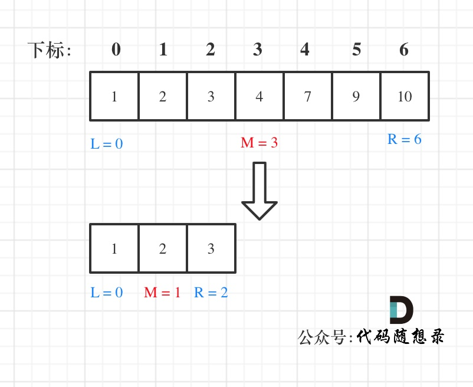
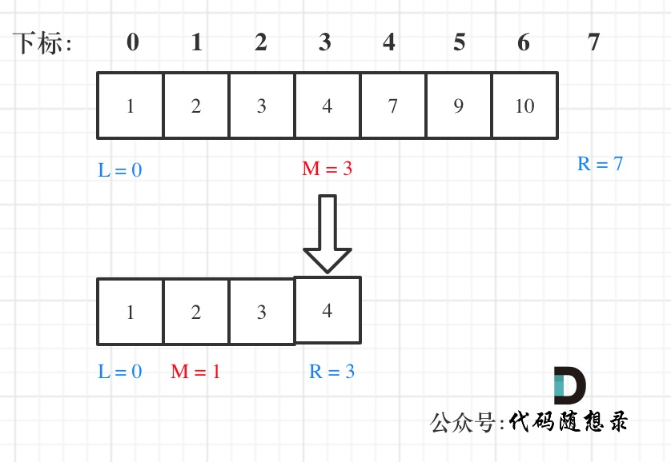

## 字符串

### 1 反转字符串


## 数组

### 1 数组理论基础

数组是非常基础的数据结构，在面试中，考察数组的题目一般在思维上都不难，主要是考察对代码的掌控能力

也就是说，想法很简单，但实现起来 可能就不是那么回事了。

首先要知道数组在内存中的存储方式，这样才能真正理解数组相关的面试题

**数组是存放在连续内存空间上的相同类型数据的集合。**

数组可以方便的通过下标索引的方式获取到下标下对应的数据。

举一个字符数组的例子，如图所示：


需要两点注意的是

- **数组下标都是从0开始的。**
- **数组内存空间的地址是连续的**

正是**因为数组的在内存空间的地址是连续的，所以我们在删除或者增添元素的时候，就难免要移动其他元素的地址。**

例如删除下标为3的元素，需要对下标为3的元素后面的所有元素都要做移动操作，如图所示：


而且大家如果使用C++的话，要注意vector 和 array的区别，vector的底层实现是array，严格来讲vector是容器，不是数组。

**数组的元素是不能删的，只能覆盖。**

那么二维数组直接上图，大家应该就知道怎么回事了


**那么二维数组在内存的空间地址是连续的么？**

不同编程语言的内存管理是不一样的，以C++为例，在C++中二维数组是连续分布的。

我们来做一个实验，C++测试代码如下：

```cpp
void test_arr() {
    int array[2][3] = {
		{0, 1, 2},
		{3, 4, 5}
    };
    cout << &array[0][0] << " " << &array[0][1] << " " << &array[0][2] << endl;
    cout << &array[1][0] << " " << &array[1][1] << " " << &array[1][2] << endl;
}

int main() {
    test_arr();
}
```


测试地址为

```text
0x7ffee4065820 0x7ffee4065824 0x7ffee4065828
0x7ffee406582c 0x7ffee4065830 0x7ffee4065834
```


注意地址为16进制，可以看出二维数组地址是连续一条线的。

一些录友可能看不懂内存地址，我就简单介绍一下， 0x7ffee4065820 与 0x7ffee4065824 差了一个4，就是4个字节，因为这是一个int型的数组，所以两个相邻数组元素地址差4个字节。

0x7ffee4065828 与 0x7ffee406582c 也是差了4个字节，在16进制里8 + 4 = c，c就是12。

如图：


**所以可以看出在C++中二维数组在地址空间上是连续的**。

像Java是没有指针的，同时也不对程序员暴露其元素的地址，寻址操作完全交给虚拟机。

所以看不到每个元素的地址情况，这里我以Java为例，也做一个实验。

```java
public static void test_arr() {
    int[][] arr = {{1, 2, 3}, {3, 4, 5}, {6, 7, 8}, {9,9,9}};
    System.out.println(arr[0]);
    System.out.println(arr[1]);
    System.out.println(arr[2]);
    System.out.println(arr[3]);
}
```


输出的地址为：

```text
[I@7852e922
[I@4e25154f
[I@70dea4e
[I@5c647e05
```


这里的数值也是16进制，这不是真正的地址，而是经过处理过后的数值了，我们也可以看出，二维数组的每一行头结点的地址是没有规则的，更谈不上连续。

所以Java的二维数组可能是如下排列的方式：


### 2 704. 二分查找


给定一个 n 个元素有序的（升序）整型数组 nums 和一个目标值 target  ，写一个函数搜索 nums 中的 target，如果目标值存在返回下标，否则返回 -1。

示例 1:

```text
输入: nums = [-1,0,3,5,9,12], target = 9     
输出: 4       
解释: 9 出现在 nums 中并且下标为 4     
```

示例 2:

```text
输入: nums = [-1,0,3,5,9,12], target = 2     
输出: -1        
解释: 2 不存在 nums 中因此返回 -1        
```

提示：

- 你可以假设 nums 中的所有元素是不重复的。
- n 将在 [1, 10000]之间。
- nums 的每个元素都将在 [-9999, 9999]之间。


#### 思路

**这道题目的前提是数组为有序数组**，同时题目还强调**数组中无重复元素**，因为一旦有重复元素，使用二分查找法返回的元素下标可能不是唯一的，这些都是使用二分法的前提条件，当大家看到题目描述满足如上条件的时候，可要想一想是不是可以用二分法了。

二分查找涉及的很多的边界条件，逻辑比较简单，但就是写不好。例如到底是 `while(left < right)` 还是 `while(left <= right)`，到底是`right = middle`呢，还是要`right = middle - 1`呢？

大家写二分法经常写乱，主要是因为**对区间的定义没有想清楚，区间的定义就是不变量**。要在二分查找的过程中，保持不变量，就是在while寻找中每一次边界的处理都要坚持根据区间的定义来操作，这就是**循环不变量**规则。

写二分法，区间的定义一般为两种，左闭右闭即[left, right]，或者左闭右开即[left, right)。

下面我用这两种区间的定义分别讲解两种不同的二分写法。

#### 二分法第一种写法

第一种写法，我们定义 target 是在一个在左闭右闭的区间里，**也就是[left, right] （这个很重要非常重要）**。

区间的定义这就决定了二分法的代码应该如何写，**因为定义target在[left, right]区间，所以有如下两点：**

- while (left <= right) 要使用 <= ，因为left == right是有意义的，所以使用 <=
- if (nums[middle] > target) right 要赋值为 middle - 1，因为当前这个nums[middle]一定不是target，那么接下来要查找的左区间结束下标位置就是 middle - 1

例如在数组：1,2,3,4,7,9,10中查找元素2，如图所示：



代码如下：（详细注释）

```cpp
// 版本一
class Solution {
public:
    int search(vector<int>& nums, int target) {
        int left = 0;
        int right = nums.size() - 1; // 定义target在左闭右闭的区间里，[left, right]
        while (left <= right) { // 当left==right，区间[left, right]依然有效，所以用 <=
            int middle = left + ((right - left) / 2);// 防止溢出 等同于(left + right)/2
            if (nums[middle] > target) {
                right = middle - 1; // target 在左区间，所以[left, middle - 1]
            } else if (nums[middle] < target) {
                left = middle + 1; // target 在右区间，所以[middle + 1, right]
            } else { // nums[middle] == target
                return middle; // 数组中找到目标值，直接返回下标
            }
        }
        // 未找到目标值
        return -1;
    }
};
```

- 时间复杂度：O(log n)
- 空间复杂度：O(1)

#### 二分法第二种写法

如果说定义 target 是在一个在左闭右开的区间里，也就是[left, right) ，那么二分法的边界处理方式则截然不同。

有如下两点：

- while (left < right)，这里使用 < ,因为left == right在区间[left, right)是没有意义的
- if (nums[middle] > target) right 更新为 middle，因为当前nums[middle]不等于target，去左区间继续寻找，而寻找区间是左闭右开区间，所以right更新为middle，即：下一个查询区间不会去比较nums[middle]

在数组：1,2,3,4,7,9,10中查找元素2，如图所示：（**注意和方法一的区别**）



代码如下：（详细注释）

```cpp
// 版本二
class Solution {
public:
    int search(vector<int>& nums, int target) {
        int left = 0;
        int right = nums.size(); // 定义target在左闭右开的区间里，即：[left, right)
        while (left < right) { // 因为left == right的时候，在[left, right)是无效的空间，所以使用 <
            int middle = left + ((right - left) >> 1);
            if (nums[middle] > target) {
                right = middle; // target 在左区间，在[left, middle)中
            } else if (nums[middle] < target) {
                left = middle + 1; // target 在右区间，在[middle + 1, right)中
            } else { // nums[middle] == target
                return middle; // 数组中找到目标值，直接返回下标
            }
        }
        // 未找到目标值
        return -1;
    }
};
```

- 时间复杂度：O(log n)
- 空间复杂度：O(1)

#### 相关题目 35.搜索插入位置

给定一个排序数组和一个目标值，在数组中找到目标值，并返回其索引。如果目标值不存在于数组中，返回它将会被按顺序插入的位置。

你可以假设数组中无重复元素。

示例 1:

- 输入: [1,3,5,6], 5
- 输出: 2

示例 2:

- 输入: [1,3,5,6], 2
- 输出: 1

示例 3:

- 输入: [1,3,5,6], 7
- 输出: 4

示例 4:

- 输入: [1,3,5,6], 0
- 输出: 0

```java
public class Solution35 {
    public int searchInsert(int[] nums,int target) {
        int n = nums.length;

        int low = 0;
        int high = n - 1;

        while (low<= high) {
            int mid = low + ((high-low)>>1);
            if (nums[mid] == target)
                return mid;
            else if (nums[mid]<target)
                low = mid + 1;
            else if (nums[mid]>target)
                high = mid -1;
        }

        return high+1;
    }

    public int searchInsert1(int[] nums,int target) {
        int n = nums.length;

        int low = 0;
        int high = n;

        while (low< high) {
            int mid = low + ((high-low)>>1);
            if (nums[mid] == target)
                return mid;
            else if (nums[mid]<target)
                low = mid + 1;
            else if (nums[mid]>target)
                high = mid;
        }

        return high;
    }

    public static void main(String[] args) {
        int [] arr = {1,3,5,7,9};
        System.out.println(new Solution35().searchInsert1(arr, 4));
    }
}
```


#### 相关题目 34.在排序数组中查找元素的第一个和最后一个位置(opens new window)

给定一个按照升序排列的整数数组 nums，和一个目标值 target。找出给定目标值在数组中的开始位置和结束位置。

如果数组中不存在目标值 target，返回 [-1, -1]。

进阶：你可以设计并实现时间复杂度为 $O(\log n)$ 的算法解决此问题吗？

示例 1：

- 输入：nums = [5,7,7,8,8,10], target = 8
- 输出：[3,4]

示例 2：

- 输入：nums = [5,7,7,8,8,10], target = 6
- 输出：[-1,-1]

示例 3：

- 输入：nums = [], target = 0
- 输出：[-1,-1]


写两个二分，分别查找左右边界

就是分别从右和从左找target，但target有三种情况:

1. 超出范围
2. 在范围内，不存在
3. 只有一个值

既然分别找，就写两个方法作为分别找到之后的索引值

```java
int getRightBorder(int[] nums, int target);
int getLeftBorder(int[] nums, int target);
```


相关题目

相关题目


- [69.x 的平方根(opens new window)](https://leetcode.cn/problems/sqrtx/)
- [367.有效的完全平方数(opens new window)](https://leetcode.cn/problems/valid-perfect-square/)