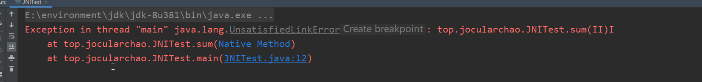
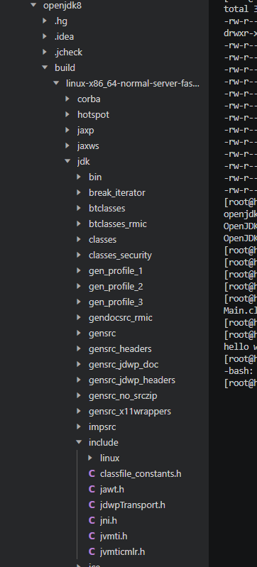
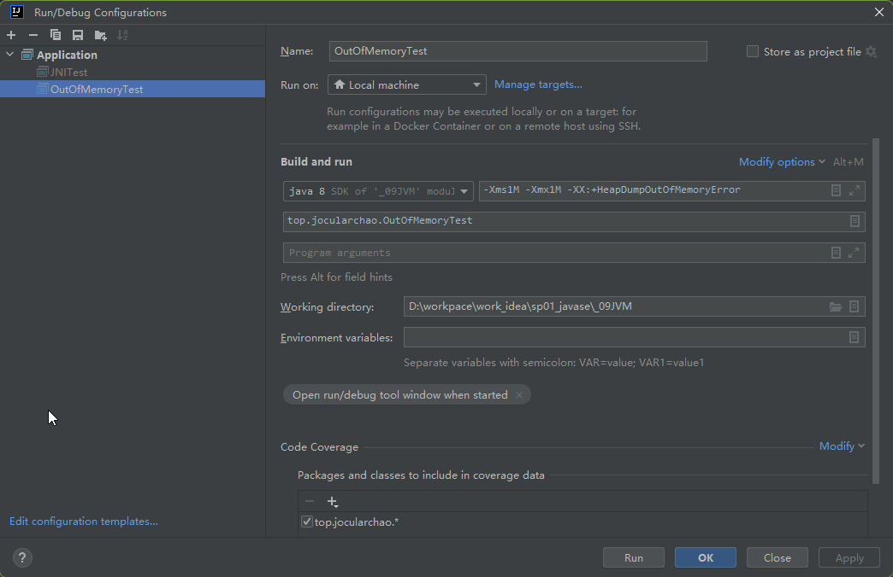

## JVM


### 1 基础

#### 1.1 手动编译JDK

##### 1.1.1 centOS系统 7.9

```bash
    1  2023-10-11 17:22:43 root ll
    2  2023-10-11 17:22:47 root ls
    3  2023-10-11 17:50:07 root ll
    4  2023-10-11 17:57:35 root yum install java-1.8.0-openjdk*
    5  2023-10-11 17:59:36 root  java -version
    6  2023-10-11 18:00:02 root yum install hg
    7  2023-10-11 18:00:41 root yum install alsa-lib-devel cups-devel libX* gcc gcc-c++ freetype-devel libstdc++-static ant make
    8  2023-10-11 18:01:29 root yum install zip
    9  2023-10-11 18:02:11 root hg clone http://hg.openjdk.java.net/jdk8u/jdk8u openjdk8
   10  2023-10-11 18:02:28 root cd openjdk8/
   11  2023-10-11 18:02:38 root sh get_source.sh
   12  2023-10-11 18:06:58 root chmod +x configure
   13  2023-10-11 18:07:05 root ./configure --enable-debug
   14  2023-10-11 18:07:31 root make
   15  2023-10-11 18:23:35 root /root/openjdk8/build/linux-x86_64-normal-server-fastdebug/jdk/bin
   16  2023-10-11 18:23:55 root /build/linux-x86_64-normal-server-fastdebug/jdk/bin
   17  2023-10-11 18:24:52 root cd build/linux-x86_64-normal-server-fastdebug/
   18  2023-10-11 18:24:53 root ls
   19  2023-10-11 18:25:08 root cd jdk/
   20  2023-10-11 18:25:09 root ls
   21  2023-10-11 18:25:53 root cd bin
   22  2023-10-11 18:25:57 root java --version
   23  2023-10-11 18:26:27 root java -version
   24  2023-10-11 18:27:27 root history
```


1.1.2 windows 下编译OpenJDK6

#### 1.2 gateway连接jdk目录


启动项目，配置运行


#### 1.3 JVM启动流程

1. 配置JVM装载环境
2. 解析虚拟机参数
3. 设置线程栈大小
4. 执行JavaMain方法


##### 1.3.1 JLI_Launch函数

```c
/*
 * Entry point.
 */
int
JLI_Launch(int argc, char ** argv,              /* main argc, argc */
        int jargc, const char** jargv,          /* java args */
        int appclassc, const char** appclassv,  /* app classpath */
        const char* fullversion,                /* full version defined */
        const char* dotversion,                 /* dot version defined */
        const char* pname,                      /* program name */
        const char* lname,                      /* launcher name */
        jboolean javaargs,                      /* JAVA_ARGS */
        jboolean cpwildcard,                    /* classpath wildcard*/
        jboolean javaw,                         /* windows-only javaw */
        jint ergo                               /* ergonomics class policy */
)
```

当前的完整版本名称、简短版本名称、运行参数、程序名称、启动器名称等。

首先会进行一些初始化操作以及Debug信息打印配置等：

```c
InitLauncher(javaw);
DumpState();
if (JLI_IsTraceLauncher()) {
    int i;
    printf("Command line args:\n");
    for (i = 0; i < argc ; i++) {
        printf("argv[%d] = %s\n", i, argv[i]);
    }
    AddOption("-Dsun.java.launcher.diag=true", NULL);
}
```

接着就是选择一个合适的JRE版本：

```c
/*
 * Make sure the specified version of the JRE is running.
 *
 * There are three things to note about the SelectVersion() routine:
 *  1) If the version running isn't correct, this routine doesn't
 *     return (either the correct version has been exec'd or an error
 *     was issued).
 *  2) Argc and Argv in this scope are *not* altered by this routine.
 *     It is the responsibility of subsequent code to ignore the
 *     arguments handled by this routine.
 *  3) As a side-effect, the variable "main_class" is guaranteed to
 *     be set (if it should ever be set).  This isn't exactly the
 *     poster child for structured programming, but it is a small
 *     price to pay for not processing a jar file operand twice.
 *     (Note: This side effect has been disabled.  See comment on
 *     bugid 5030265 below.)
 */
SelectVersion(argc, argv, &main_class);
```

然后创建JVM执行环境，例如需要确定数据模型，是32位还是64位，以及jvm本身的一些配置在jvm.cfg文件中读取和解析：

```c
CreateExecutionEnvironment(&argc, &argv,
                           jrepath, sizeof(jrepath),
                           jvmpath, sizeof(jvmpath),
                           jvmcfg,  sizeof(jvmcfg));
```

此函数只在头文件中定义，具体的实现是根据不同平台而定的。接着会动态加载jvm.so这个共享库，并把jvm.so中的相关函数导出并且初始化，而启动JVM的函数也在其中：

```c
if (!LoadJavaVM(jvmpath, &ifn)) {
    return(6);
}
```

最后对JVM进行初始化

```c
return JVMInit(&ifn, threadStackSize, argc, argv, mode, what, ret);
```

最后进入了一个`ContinueInNewThread`函数（在刚刚的`java.c`中实现），这个函数会创建一个新的线程来执行：

```c
int
ContinueInNewThread(InvocationFunctions* ifn, jlong threadStackSize,
                    int argc, char **argv,
                    int mode, char *what, int ret)
{
	.......
	      rslt = ContinueInNewThread0(JavaMain, threadStackSize, (void*)&args);
      /* If the caller has deemed there is an error we
       * simply return that, otherwise we return the value of
       * the callee
       */
      return (ret != 0) ? ret : rslt;
}
```

新的线程ContinueInNewThread0函数：

```c
int
ContinueInNewThread0(int (JNICALL *continuation)(void *), jlong stack_size, void * args) {
    int rslt;
    pthread_t tid;
    pthread_attr_t attr;
    pthread_attr_init(&attr);
    pthread_attr_setdetachstate(&attr, PTHREAD_CREATE_JOINABLE);

    if (stack_size > 0) {
      pthread_attr_setstacksize(&attr, stack_size);
    }

    if (pthread_create(&tid, &attr, (void *(*)(void*))continuation, (void*)args) == 0) {
      void * tmp;
      pthread_join(tid, &tmp);
      rslt = (int)tmp;
    } else {
     /*
      * Continue execution in current thread if for some reason (e.g. out of
      * memory/LWP)  a new thread can't be created. This will likely fail
      * later in continuation as JNI_CreateJavaVM needs to create quite a
      * few new threads, anyway, just give it a try..
      */
      rslt = continuation(args);
    }

    pthread_attr_destroy(&attr);
    return rslt;
}
```

##### 1.3.2 JavaMain

最后实际上是在新的线程中执行`JavaMain`函数:

```c
/* Initialize the virtual machine */
start = CounterGet();
if (!InitializeJVM(&vm, &env, &ifn)) {
    JLI_ReportErrorMessage(JVM_ERROR1);
    exit(1);
}
```

- 第一步初始化虚拟机，如果报错直接退出。接着就是加载主类（至于具体如何加载一个类，我们会放在后面进行讲解），因为主类是我们Java程序的入口点：

```c
    /*
     * Get the application's main class.
     *
     * See bugid 5030265.  The Main-Class name has already been parsed
     * from the manifest, but not parsed properly for UTF-8 support.
     * Hence the code here ignores the value previously extracted and
     * uses the pre-existing code to reextract the value.  This is
     * possibly an end of release cycle expedient.  However, it has
     * also been discovered that passing some character sets through
     * the environment has "strange" behavior on some variants of
     * Windows.  Hence, maybe the manifest parsing code local to the
     * launcher should never be enhanced.
     *
     * Hence, future work should either:
     *     1)   Correct the local parsing code and verify that the
     *          Main-Class attribute gets properly passed through
     *          all environments,
     *     2)   Remove the vestages of maintaining main_class through
     *          the environment (and remove these comments).
     *
     * This method also correctly handles launching existing JavaFX
     * applications that may or may not have a Main-Class manifest entry.
     */
    mainClass = LoadMainClass(env, mode, what);
```

- 某些没有主方法的Java程序比如JavaFX应用，会获取ApplicationMainClass：

```c
/*
 * In some cases when launching an application that needs a helper, e.g., a
 * JavaFX application with no main method, the mainClass will not be the
 * applications own main class but rather a helper class. To keep things
 * consistent in the UI we need to track and report the application main class.
 */
appClass = GetApplicationClass(env);
```

- 初始化完成

```c
/*
 * PostJVMInit uses the class name as the application name for GUI purposes,
 * for example, on OSX this sets the application name in the menu bar for
 * both SWT and JavaFX. So we'll pass the actual application class here
 * instead of mainClass as that may be a launcher or helper class instead
 * of the application class.
 */
PostJVMInit(env, appClass, vm);
```

- 接着就是获取主类中的主方法：

```c
/*
 * The LoadMainClass not only loads the main class, it will also ensure
 * that the main method's signature is correct, therefore further checking
 * is not required. The main method is invoked here so that extraneous java
 * stacks are not in the application stack trace.
 */
mainID = (*env)->GetStaticMethodID(env, mainClass, "main",
                                   "([Ljava/lang/String;)V");
```

- 接着就是调用主方法了

```c
/* Invoke main method. */
(*env)->CallStaticVoidMethod(env, mainClass, mainID, mainArgs);

/*
     * The launcher's exit code (in the absence of calls to
     * System.exit) will be non-zero if main threw an exception.
     */
/*调用后，我们的Java程序就开飞速运行起来，直到走到主方法的最后一行返回*/
ret = (*env)->ExceptionOccurred(env) == NULL ? 0 : 1;
LEAVE();
```

在最后LEAVE函数中会销毁JVM


#### 1.4 JNI调用本地方法

java还有一个机制，叫java natice interface，即java本地接口。它允许在JVM内运行的Java代码与其他编程语言（如C/C++和汇编语言）编写的程序和库进行交互（在Android开发中用得比较多）

##### 1.4.1 生成.h头文件

- 创建java项目


- 执行生成class文件，此时报错native修饰的方法未与c库交互



- 我们在src下打开cmd

` E:\environment\jdk\jdk-8u381\bin\javah -d ../jni top.jocularchao.JNITest`


- 我们成功执行javah命令生产力.h头文件


```h
/* DO NOT EDIT THIS FILE - it is machine generated */
#include <jni.h>
/* Header for class top_jocularchao_JNITest */

#ifndef _Included_top_jocularchao_JNITest
#define _Included_top_jocularchao_JNITest
#ifdef __cplusplus
extern "C" {
#endif
/*
 * Class:     top_jocularchao_JNITest
 * Method:    sum
 * Signature: (II)I  ->int(int ,int )
 */
JNIEXPORT jint JNICALL Java_top_jocularchao_JNITest_sum
  (JNIEnv *, jclass, jint, jint);

#ifdef __cplusplus
}
#endif
#endif
```


##### 1.4.2 引入头文件

- 新建c++项目


- linux系统或windows系统安装jdk目录下，找到include中的jni.h文件




- 因为我们创建的是本地的windows系统项目，就把其文件配置放入CMakeLists.txt文件中

```txt
cmake_minimum_required(VERSION 3.26)
project(jvm01_jni)

include_directories(E:/environment/jdk/jdk-8u381/include)
include_directories(E:/environment/jdk/jdk-8u381/include/darwin)
set(CMAKE_CXX_STANDARD 14)

add_executable(jvm01_jni top_jocularchao_JNITest.cpp top_jocularchao_JNITest.h)
```

- 修改cpp文件，并执行


### 2 内存管理

​	在传统的C/C++开发中，我们经常通过使用申请内存的方式来创建对象或是存放某些数据，但是这样也带来了一些额外的问题，我们要在何时释放这些内存，怎么才能使得内存的使用最高效，因此，内存管理是一个非常严肃的问题。

```c
#include <stdlib.h>
#include <stdio.h>

int main(){
    //动态申请4个int大小的内存空间
    int* memory = static_cast<int *>(malloc(sizeof(int) * 4));
    //修改第一个int空间的值
    memory[0] = 10;
    //修改第二个int空间的值
    memory[1] = 2;
    //遍历内存区域中所有的值
    for (int i = 0;i < 4;i++){
        printf("%d ", memory[i]);
    }
    //释放指针所指向的内存区域
    free(memory);
    //最后将指针赋值为NULL
    memory = NULL;
}
```

​	而在Java中，这种操作实际上是不允许的，Java只支持直接使用基本数据类型和对象类型，至于内存到底如何分配，并不是由我们来处理，而是JVM帮助我们进行控制，这样就帮助我们节省很多内存上的工作，虽然带来了很大的便利，但是，一旦出现内存问题，我们就无法像C/C++那样对所管理的内存进行合理地处理，因为所有的内存操作都是由JVM在进行，只有了解了**JVM的内存管理机制**，我们才能够在出现内存相关问题时找到解决方案。


#### 2.1 内存区域划分

​	JVM对内存的管理采用的是分区治理，不同的内存区域有着各自的职责所在，在虚拟机运行时，内存区域如下划分：


此时我们可以看出，运行时数据区域分为5个，**方法区和堆**是所有线程共享的区域，随着虚拟机的创建而创建，虚拟机的结束而销毁，而**虚拟机栈、本地方法栈和程序计数器**都是线程之间互相隔离的，每个线程都有一个自己的区域，并且线程启动时会自动创建，结束之后会自动销毁。内存划分完成之后，我们的JVM执行引擎和本地库接口，也就是Java程序开始运行之后就会根据分区合理地使用对应区域的内存了。


##### 2.1.1 程序计数器

​	Program Counter Register 是一个较小的内存空间，它可以看作是当前线程所执行的字节码的行号指示器。字节码解释器工作时就是通过改变这个 计数器的值来选取下一条需要执行的字节码指令，它是程序控制流 的指示器，分支、循环、跳转、异常处理、线程恢复等基础功能都 需要依赖这个计数器来完成。

​	由于Java虚拟机的多线程是通过线程轮流切换、分配处理器执 行时间的方式来实现的，即依靠时间片轮转算法进行的，在任何一个确定的时刻，一个处理器（对 于多核处理器来说是一个内核）都只会执行一条线程中的指令。

​	因此，为了线程切换后能恢复到正确的执行位置，每条线程都需要有一个独立的程序计数器，各条线程之间计数器互不影响，独立存储。

​	程序计数器因为只需要记录很少的信息，所以只占用很少一部分内存。


##### 2.1.2 java虚拟机栈

​	Java Virtual Machine Stack 是一个非常关键的部分，如其名，它是一个栈结构。


​	每个方法被执行的时候，java虚拟机都会同步创建一个栈帧（stack frame） 用于存储当前方法的局部变量表、操作数栈、动态链接、方法出口等信息。

​	

##### 2.1.3 本地方法栈

​	Native Method Stacks 与虚拟机栈所发挥的作用非常类似：

- 虚拟机栈为虚拟机执行java方法也就是字节码服务
- 本地方法栈则是为虚拟机使用到的本地方法服务

​	与虚拟机栈一样，本地方法 栈也会在栈深度溢出或者栈扩展失败时分别抛出StackOverflowError 和OutOfMemoryError异常


##### 2.1.4 堆

​	Heap 是虚拟机所管理的内存中最大的一块。

​	此内存区域的唯一目的就是存放和管理对象实例和数组。**垃圾回收机制主要作用就在这一部分**


##### 2.1.5 方法区

​	Method Area 用于存储已被虚拟机加载的类型信息、常量、静态变量、即时编译器编译后的代码缓存等数据。

​	其可以分为两部分：类信息表、运行时常量池


> 类信息表：

​	Class文件中有类的版本、字段、方法、接口等描述信息。


> 运行时常量池：

​	class文件中有常量池表，用于存放编译期生成的各种字面量与符号引用，这部分内容将在类加载后存放到方法去的运行时常量池中。

​	运行时常量池相对于Class文件常量池的另外一个重要特征是具 备动态性，Java语言并不要求常量一定只有编译期才能产生，也就 是说，并非预置入Class文件中常量池的内容才能进入方法区运行时 常量池，运行期间也可以将新的常量放入池中，这种特性被开发人 员利用得比较多的便是String类的intern()方法。


##### 2.1.6 爆内存和爆栈

> 爆内存

​	java程序运行时，内存容量不可能是无限制的，当我们对象创建过多或是数组容量过大，会导致我们的堆内存不足以存放新的对象或是数组，就会出现错误：


​	这里得到了一个`OutOfMemoryError`错误，也就是我们常说的内存溢出错误。我们可以通过参数来控制堆内存的最大值和最小值：

```txt
-Xms最小值 -Xmx最大值
```

我们现在限制堆内存为固定值1M大小:

```
-Xms1M -Xmx1M 
```

并且在抛出内存溢出异常时保存当前的内存堆转储快照：

```
-XX:+HeapDumpOutOfMemoryError
```




注意堆内存不要设置太小，不然连虚拟机都不足以启动，接着我们编写一个一定会导致内存溢出的程序：


此时已经创建了31619个Test对象，堆内存绷不住了，抛出了内存溢出错误


> 爆栈

递归！

```java
public static void main(String[] args) {
    test();
}

public static void test() {
    test();
}
```

这很明显是一个永无休止的程序，并且会不断继续向下调用test方法本身，那么按照我们之前的逻辑推导，无限地插入栈帧那么一定会将虚拟机栈塞满，所以，当栈的深度已经不足以继续插入栈帧时，就会这样：

 ```bash
 Exception in thread "main" java.lang.StackOverflowError
 	at top.jocularchao.OutOfMemoryTest.test(OutOfMemoryTest.java:28)
 	at top.jocularchao.OutOfMemoryTest.test(OutOfMemoryTest.java:28)
 	at top.jocularchao.OutOfMemoryTest.test(OutOfMemoryTest.java:28)
 	at top.jocularchao.OutOfMemoryTest.test(OutOfMemoryTest.java:28)
 	at top.jocularchao.OutOfMemoryTest.test(OutOfMemoryTest.java:28)
 	.........
 ```

这也是我们常说的栈溢出，它和堆溢出比较类似，也是由于容纳不下才导致的，我们可以使用`-Xss`来设定栈容量。


##### 2.1.7 申请堆外内存

​	除了堆内存可以存放对象数据以外，我们也可以申请堆外内存（==**直接内存**==），也就是不受JVM管控的内存区域，这部分区域的内存需要我们自行去申请和释放，实际上本质就是JVM通过C/C++调用`malloc`函数申请的内存，当然得我们自己去释放了。不过虽然是直接内存，不会受到堆内存容量限制，但是依然会受到本机最大内存的限制，所以还是有可能抛出`OutOfMemoryError`异常。

> 直接内存：
>
> ​	Direct Memory 并不是虚拟机运行时数据区的一部分，也不是《Java虚拟机规范》中定义的内存区域。但是这部分内 存也被频繁地使用，而且也可能导致OutOfMemoryError异常出现。
>
> ​	在JDK 1.4中新加入了NIO（New Input/Output）类，引入了一 种基于通道（Channel）与缓冲区（Buffer）的I/O方式，它可以使用 Native函数库直接分配堆外内存，然后通过一个存储在Java堆里面 的DirectByteBuffer对象作为这块内存的引用进行操作。这样能在一 些场景中显著提高性能，因为避免了在Java堆和Native堆中来回复 制数据。
>
> ​	显然，本机直接内存的分配不会受到Java堆大小的限制，但 是，既然是内存，则肯定还是会受到本机总内存（包括物理内存、 SWAP分区或者分页文件）大小以及处理器寻址空间的限制，一般 服务器管理员配置虚拟机参数时，会根据实际内存去设置-Xmx等参 数信息，但经常忽略掉直接内存，使得各个内存区域总和大于物理 内存限制（包括物理的和操作系统级的限制），从而导致动态扩展 时出现OutOfMemoryError异常。

这里我们需要提到一个堆外内存操作类：`Unsafe`，就像它的名字一样，虽然Java提供堆外内存的操作类，但是实际上它是不安全的，只有你完全了解底层原理并且能够合理控制堆外内存，才能安全地使用堆外内存。

注意这个类不让我们new，也没有直接获取方式（压根就没想让我们用）：

```java
public final class Unsafe {

	private static final Unsafe theUnsafe;

    private static native void registerNatives();

    private Unsafe() {
    }

    @CallerSensitive
    public static Unsafe getUnsafe() {
        Class var0 = Reflection.getCallerClass();
        if (!VM.isSystemDomainLoader(var0.getClassLoader())) {
            throw new SecurityException("Unsafe");
        } else {
            return theUnsafe;
        }
    }
        static {
        registerNatives();
        Reflection.registerMethodsToFilter(Unsafe.class, new String[]{"getUnsafe"});
    }
}
```

既然无法new，那么我们就用反射调出来:

```java
        Field field = Unsafe.class.getDeclaredFields()[0];
        field.setAccessible(true);
        Unsafe unsafe = (Unsafe) field.get(null);
```

拿到Unsafe对象后，就可以申请堆外内存了：

```java
public class UnSafeTest {
    public static void main(String[] args) throws IllegalAccessException {
        Field field = Unsafe.class.getDeclaredFields()[0];
        field.setAccessible(true);
        Unsafe unsafe = (Unsafe) field.get(null);

        //申请4字节大小的内存空间，并得到对应位置的地址
        long address = unsafe.allocateMemory(4);
        //在对应的地址上设定int的值
        unsafe.putInt(address, 6666666);
        //获取对应地址上的Int型数值
        System.out.println(unsafe.getInt(address));
        //释放申请到的内容
        unsafe.freeMemory(address);

        //由于内存已经释放，这时数据就没了
        System.out.println(unsafe.getInt(address));

    }
}
```


#### 2.2 垃圾回收机制

垃圾回收(Garbage Collection)：

·哪些内存需要回收？


·什么时候回收？ 


·如何回收？


对象存活判定算法


垃圾回收算法


垃圾收集器实现


### 3 类与类加载


类文件结构


类加载机制

