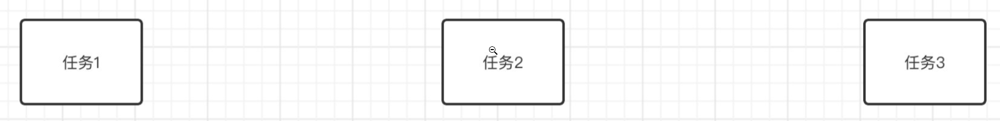
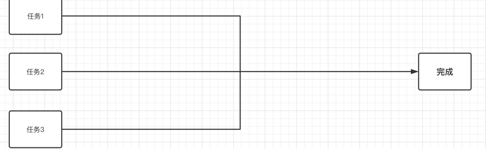

## JUC

​	Java 5新增了java.util.concurrent（**JUC**）包，其中包括大量用于多线程编程的工具类，目的是为了更好的支持高并发任务，让开发者进行多线程编程时减少竞争条件和死锁的问题

​	

### 1 并发和并行

#### 1.1 顺序执行

​	同一时间只能处理一个任务，所以需要前一个任务完成之后，才能继续下一个任务，依次完成所有任务

#### 1.2 并发执行

​	同一时间只能处理一个任务，但是我们可以每个任务轮流着做（时间片轮转）

​	只要我们单次处理分配的时间足够的短，在宏观看来，就是三个任务在同时进行。

​	而我们Java中的线程，正是这种机制，当我们需要同时处理上百个上千个任务时，很明显CPU的数量是不可能赶得上我们的线程数的，所以说这时就要求我们的程序有良好的并发性能，来应对同一时间大量的任务处理。学习Java并发编程，能够让我们在以后的实际场景中，知道该如何应对高并发的情况。

#### 1.3 并行执行

​	同一时间可以做多个任务

​	

### 2 锁机制

​	通过使用`synchronized`关键字来实现锁，这样就能够很好地解决线程之间争抢资源的情况。那么，`synchronized`底层到底是如何实现的呢？

2.1 重量级锁

2.2 轻量级锁

2.3 偏向锁

2.4 锁消除和

### 3 JMM内存模型

### 4 锁框架

### 5 原子类

### 6 并发容器

### 7 线程池

### 8 并发工具类