# javaSE

## 0 idea快捷键

ctrl+clt+t   if、for、try快捷键

alt + F8 评估表达式

ctrl+alt+shift+u 查看类的关系图


## 0 jdk

jdk 1.8`.;%JAVA_HOME%\lib;%JAVA_HOME%\lib\dt.jar;%JAVA_HOME%\lib\tools.jar`

jdk 17 `.;%JAVA_HOME%\lib;%JRE_HOME%\lib`

导出jre jdk目录下 `bin\jlink.exe --module-path jmods --add-modules java.desktop --output jre`


## 11 泛型

​	为了统计学生成绩，要求设计一个Score对象，包括课程名称、课程号、课程成绩，但是成绩分为两种，一种是以优秀、良好、合格来作为成绩，还有一种就是 `60.0、75.5、92.5` 这样的数字分数，可能高等数学这门课是以数字成绩进行结算，而计算机网络实验这门课是以等级进行结算，这两种分数类型都有可能出现，那么现在该如何去设计这样的一个Score类呢？

现在的问题就是，成绩可能是`String`类型，也可能是`Integer`类型，如何才能很好的去存可能出现的两种类型呢？

```java
public class Score {
    String name;
    String id;
    Object value;  //因为Object是所有类型的父类，因此既可以存放Integer也能存放String

  	public Score(String name, String id, Object value) {
        this.name = name;
        this.id = id;
        this.value = value;
    }
}
```

以上的方法虽然很好地解决了多种类型存储问题，但是Object类型在编译阶段并不具有良好的类型判断能力，很容易出现以下的情况：

```java
public static void main(String[] args) {

    Score score = new Score("数据结构与算法基础", "EP074512", "优秀");  //是String类型的

    ...

    Integer number = (Integer) score.score;  //获取成绩需要进行强制类型转换，虽然并不是一开始的类型，但是编译不会报错
}
```

使用Object类型作为引用，对于使用者来说，由于是Object类型，所以说并不能直接判断存储的类型到底是String还是Integer，取值只能进行强制类型转换，显然无法在编译期确定类型是否安全，项目中代码量非常之大，进行类型比较又会导致额外的开销和增加代码量，如果不经比较就很容易出现类型转换异常，代码的健壮性有所欠缺

所以说这种解决办法虽然可行，但并不是最好的方案。

为了解决以上问题，JDK 5新增了泛型，它能够在编译阶段检查类型安全，大大提升开发效率。

### 泛型类

​	泛型其实就一个待定类型，我们可以使用一个特殊的名字表示泛型，泛型在定义时并不明确是什么类型，而是需要到使用时才会确定对应的泛型类型。

我们可以将一个类定义为一个泛型类：

```java
public class Score<T> {   //泛型类需要使用<>，我们需要在里面添加1 - N个类型变量
    String name;
    String id;
    T value;   //T会根据使用时提供的类型自动变成对应类型

    public Score(String name, String id, T value) {   //这里T可以是任何类型，但是一旦确定，那么就不能修改了
        this.name = name;
        this.id = id;
        this.value = value;
    }
}
```

我们来看看这是如何使用的：

```java
    public static void main(String[] args) {
        //一旦类型确定，泛型就变成对应的类型，但不影响其他对象
        Score<String> score = new Score<>("计算机网络", "20230825", "良好");
        System.out.println(score.value);

        Score<Integer> score1 = new Score<>("高数", "20230824", 91);
        System.out.println(score1.value);
    }
```

> 1、泛型将数据类型的确定控制在了编译阶段，在编写代码的时候就能明确泛型的类型，如果类型不符合，将无法通过编译！因为是具体使用对象时才会明确具体类型，所以说静态方法中是不能用的
>
> 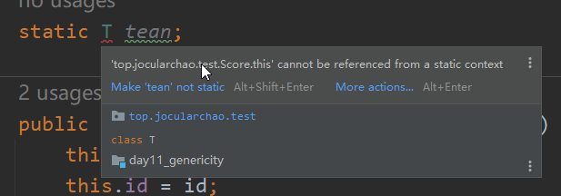
>
> 2、对泛型不要用强转，**不多大必要**
>
> ```java
> public void test(S s){
>         String a = (String) s;
>     }
> ```
>
> 3、不能通过这个泛型变量去直接创建对象和对应的数组
>
> 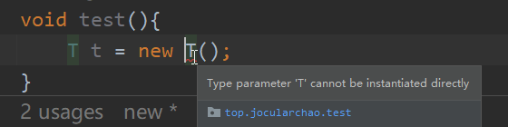
>
> 4、具体类型不同的泛型类变量，不能使用不同的变量进行接收
>
> 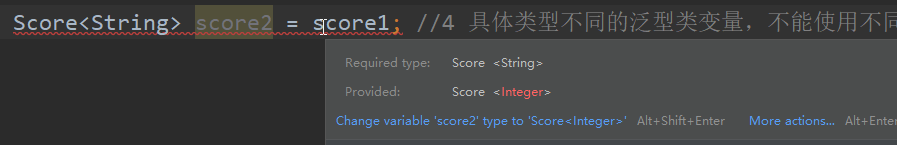
>
> 5、可以用通配符`？`来让某个变量支持引用确定了任意类型的泛型，但若使用通配符，由于类型不确定，所以说具体类型同样会变成Object
>
> ```java
> Score<?> test = new Score<Integer>();
> test = new Score<String>();
> Object o = test.value;
> ```

### 泛型与多态

不只是类，包括接口、抽象类，都是可以支持泛型的：

```java
public interface Study<T> {
    T test();
}
```

当子类实现此接口时，我们可以选择在实现类明确泛型类型，或是继续使用此泛型让具体创建的对象来确定类型：

```java
public class Main {
    public static void main(String[] args) {
        A a = new A();
        Integer i = a.test();
    }

    static class A implements Study<Integer>{
        //在实现接口或是继承父类时，如果子类是一个普通类，那么可以直接明确对应类型
        @Override
        public Integer test() {
            return null;
        }
    }
    
        static class B<T> implements Study<T>{
        //或者让子类继续为一个泛型类，那么可以不用明确
        @Override
        public T test() {
            return null;
        }
    }
    
}
```

### 泛型方法

​	当某个方法（无论是是静态方法还是成员方法）需要接受的参数类型并不确定时，我们也可以使用泛型来表示：

```java
public class demo {
    public static void main(String[] args) {
        System.out.println(test("Hello World!"));
    }

    private static <T> T test(T t){
        //在返回值类型前添加<>并填写泛型变量表示这个是一个泛型方法
        return t;
    }

}
```

### 泛型的界限

​	只需要在泛型后面加上extends关键字即可指定上界

```java
    public static void main(String[] args) {
        System.out.println(test(5.0));
    }

    private static <T extends Number> T test(T t){
        //在返回值类型前添加<>并填写泛型变量表示这个是一个泛型方法
        return t;
    }
```

​	同样的，我们也可以用通配符  下界

```java
public static void main(String[] args) {
    Score<? extends Integer> score = new Score<>("数据结构与算法", "EP074512", 60);
}
```

### 类型擦除

泛型是如何实现的呢？ 程序编译之后的样子是什么样呢？


### 函数式接口


### 判空包装


## 12 集合

​	集合类其实就是为了更好地组织、管理和操作我们的数据而存在的，包括列表、集合、队列、映射等数据结构。

​	集合跟数组：

相同：

​	1.它们都是容器，都能容纳一组元素

不同：

1. 数组的大小是固定的，集合的大小是可变的
2. 数组可以存放基本数据类型，但集合只能存放对象
3. 数组存放的类型只能是一种，但集合可以有不同种类的元素

###  集合根接口

​	Java中已经帮我们将常用的集合类型都实现好了，我们只需要直接拿来用就行了

```java
package top.jocularchao.l01start;

import java.util.ArrayList;//集合类基本都是在java.util包下定义的

/**
 * Create with IntelliJ IDEA.
 *
 * @author JocularChao
 * @date 2023/8/25 21:31
 * @Description
 */
public class Demo {
    public static void main(String[] args) {
        ArrayList<String> list = new ArrayList<>();
        list.add("666");
    }
}

```

这里用到了ArrayList类，我们查看它的类关系图来进一步学习：

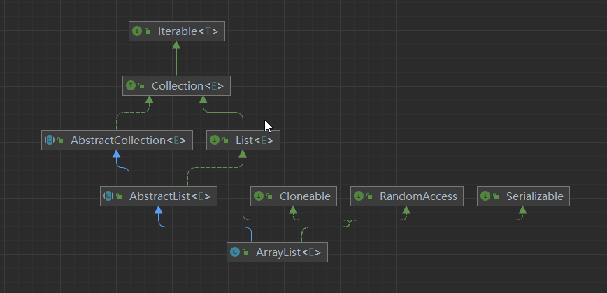

Collection接口就是集合的根接口，它定义了集合类的一些基本操作，源码分析：

```java
public interface Collection<E> extends Iterable<E> {
    //-------这些是查询相关的操作----------

   	//获取当前集合中的元素数量
    int size();

    //查看当前集合是否为空
    boolean isEmpty();

    //查询当前集合中是否包含某个元素
    boolean contains(Object o);

    //返回当前集合的迭代器，我们会在后面介绍
    Iterator<E> iterator();

    //将集合转换为数组的形式
    Object[] toArray();

    //支持泛型的数组转换，同上
    <T> T[] toArray(T[] a);

    //-------这些是修改相关的操作----------

    //向集合中添加元素，不同的集合类具体实现可能会对插入的元素有要求，
  	//这个操作并不是一定会添加成功，所以添加成功返回true，否则返回false
    boolean add(E e);

    //从集合中移除某个元素，同样的，移除成功返回true，否则false
    boolean remove(Object o);


    //-------这些是批量执行的操作----------

    //查询当前集合是否包含给定集合中所有的元素
  	//从数学角度来说，就是看给定集合是不是当前集合的子集
    boolean containsAll(Collection<?> c);

    //添加给定集合中所有的元素
  	//从数学角度来说，就是将当前集合变成当前集合与给定集合的并集
  	//添加成功返回true，否则返回false
    boolean addAll(Collection<? extends E> c);

    //移除给定集合中出现的所有元素，如果某个元素在当前集合中不存在，那么忽略这个元素
  	//从数学角度来说，就是求当前集合与给定集合的差集
  	//移除成功返回true，否则false
    boolean removeAll(Collection<?> c);

    //Java8新增方法，根据给定的Predicate条件进行元素移除操作
    default boolean removeIf(Predicate<? super E> filter) {
        Objects.requireNonNull(filter);
        boolean removed = false;
        final Iterator<E> each = iterator();   //这里用到了迭代器，我们会在后面进行介绍
        while (each.hasNext()) {
            if (filter.test(each.next())) {
                each.remove();
                removed = true;
            }
        }
        return removed;
    }

    //只保留当前集合中在给定集合中出现的元素，其他元素一律移除
  	//从数学角度来说，就是求当前集合与给定集合的交集
  	//移除成功返回true，否则false
    boolean retainAll(Collection<?> c);

    //清空整个集合，删除所有元素
    void clear();


    //-------这些是比较以及哈希计算相关的操作----------

    //判断两个集合是否相等
    boolean equals(Object o);

    //计算当前整个集合对象的哈希值
    int hashCode();

    //与迭代器作用相同，但是是并行执行的，我们会在下一章多线程部分中进行介绍
    @Override
    default Spliterator<E> spliterator() {
        return Spliterators.spliterator(this, 0);
    }

    //生成当前集合的流，我们会在后面进行讲解
    default Stream<E> stream() {
        return StreamSupport.stream(spliterator(), false);
    }

    //生成当前集合的并行流，我们会在下一章多线程部分中进行介绍
    default Stream<E> parallelStream() {
        return StreamSupport.stream(spliterator(), true);
    }
}
```

### List接口

​	List列表（线性表），线性表支持随机访问，相比之前的Collection接口定义，功能还会更多一些。

List是集合类型的一个分支，它的主要特性有：

* 是一个有序的集合，插入元素默认是插入到尾部，按顺序从前往后存放，每个元素都有一个自己的下标位置
* 列表中允许存在重复元素

在List接口中，定义了列表类型需要支持的全部操作，List直接继承自前面介绍的Collection接口，其中很多地方重新定义了一次Collection接口中定义的方法，这样做是为了更加明确方法的具体功能，当然，为了直观，我们这里就省略掉：

```java
//List是一个有序的集合类，每个元素都有一个自己的下标位置
//List中可插入重复元素
//针对于这些特性，扩展了Collection接口中一些额外的操作
public interface List<E> extends Collection<E> {
    ...
   	
    //将给定集合中所有元素插入到当前结合的给定位置上（后面的元素就被挤到后面去了，跟我们之前顺序表的插入是一样的）
    boolean addAll(int index, Collection<? extends E> c);

    ...

   	//Java 8新增方法，可以对列表中每个元素都进行处理，并将元素替换为处理之后的结果
    default void replaceAll(UnaryOperator<E> operator) {
        Objects.requireNonNull(operator);
        final ListIterator<E> li = this.listIterator();  //这里同样用到了迭代器
        while (li.hasNext()) {
            li.set(operator.apply(li.next()));
        }
    }

    //对当前集合按照给定的规则进行排序操作，这里同样只需要一个Comparator就行了
    @SuppressWarnings({"unchecked", "rawtypes"})
    default void sort(Comparator<? super E> c) {
        Object[] a = this.toArray();
        Arrays.sort(a, (Comparator) c);
        ListIterator<E> i = this.listIterator();
        for (Object e : a) {
            i.next();
            i.set((E) e);
        }
    }

    ...

    //-------- 这些是List中独特的位置直接访问操作 --------

   	//获取对应下标位置上的元素
    E get(int index);

    //直接将对应位置上的元素替换为给定元素
    E set(int index, E element);

    //在指定位置上插入元素，就跟我们之前的顺序表插入是一样的
    void add(int index, E element);

    //移除指定位置上的元素
    E remove(int index);


    //------- 这些是List中独特的搜索操作 -------

    //查询某个元素在当前列表中的第一次出现的下标位置
    int indexOf(Object o);

    //查询某个元素在当前列表中的最后一次出现的下标位置
    int lastIndexOf(Object o);


    //------- 这些是List的专用迭代器 -------

    //迭代器我们会在下一个部分讲解
    ListIterator<E> listIterator();

    //迭代器我们会在下一个部分讲解
    ListIterator<E> listIterator(int index);

    //------- 这些是List的特殊转换 -------

    //返回当前集合在指定范围内的子集
    List<E> subList(int fromIndex, int toIndex);

    ...
}
```


#### 集合的使用

一般的，我们要使用一个集合类，我们就会使用接口的引用：

```java
List<String> list3 = new ArrayList<>();
```

使用接口的引用来操作具体的集合类实现，是为了方便日后如果我们想要更换不同的集合类实现，而且接口中本身就已经定义了主要的方法，所以说没必要直接用实现类

集合类是支持嵌套使用的，一个集合中可以存放多个集合，套娃:

```java
public static void main(String[] args) {
    List<List<String>> list = new LinkedList<>();
    list.add(new LinkedList<>());   //集合中的每一个元素就是一个集合，这个套娃是可以一直套下去的
    System.out.println(list.get(0).isEmpty());
}
```

在Arrays工具类中，我们可以快速生成一个只读的List：

```java
public static void main(String[] args) {
    List<String> list = Arrays.asList("A", "B", "C");   //非常方便
    System.out.println(list);
}
```

> 这个生成的List是只读的，不能进行修改操作，只能使用获取内容相关的方法，否则抛出 UnsupportedOperationException 异常。要生成正常使用的，我们可以将这个只读的列表作为参数传入：
>
> ```java
> public static void main(String[] args) {
>     List<String> list = new ArrayList<>(Arrays.asList("A", "B", "C"));
>     System.out.println(list);
> }
> ```
>

当然，也可以利用静态代码块：

```java
public static void main(String[] args) {
    List<String> list = new ArrayList<String>() {{   //使用匿名内部类（匿名内部类在Java8无法使用钻石运算符，但是之后的版本可以）
            add("A");
            add("B");
            add("C");
    }};
    System.out.println(list);
}
```

#### ArrayList

​	首先ArrayList，它的底层是用数组实现的，内部维护的是一个**可动态进行扩容**的数组，也就是我们之前所说的顺序表。

在List接口中，扩展了大量列表支持的操作，其中最突出的就是直接根据下标位置进行的增删改查操作。而在ArrayList中，底层就是采用数组实现的，跟我们之前的顺序表思路差不多：

```java
public class ArrayList<E> extends AbstractList<E>
        implements List<E>, RandomAccess, Cloneable, java.io.Serializable
{
		
    //默认的数组容量
    private static final int DEFAULT_CAPACITY = 10;

    ...

    //存放数据的底层数组，这里的transient关键字我们会在后面I/O中介绍用途
    transient Object[] elementData;

    //记录当前数组元素数的
    private int size;

   	//这是ArrayList的其中一个构造方法
    public ArrayList(int initialCapacity) {
        if (initialCapacity > 0) {
            this.elementData = new Object[initialCapacity];   //根据初始化大小，创建当前列表
        } else if (initialCapacity == 0) {
            this.elementData = EMPTY_ELEMENTDATA;
        } else {
            throw new IllegalArgumentException("Illegal Capacity: "+
                                               initialCapacity);
        }
    }
  
  	...
      
   	public boolean add(E e) {
        ensureCapacityInternal(size + 1);  // 这里会判断容量是否充足，不充足需要扩容
        elementData[size++] = e;
        return true;
    }
  	
  	...
    
    //默认的列表最大长度为Integer.MAX_VALUE - 8
    //JVM都C++实现中，在数组的对象头中有一个_length字段，用于记录数组的长
    //度，所以这个8就是存了数组_length字段（这个只做了解就行）
		private static final int MAX_ARRAY_SIZE = Integer.MAX_VALUE - 8;
  	
  	private void grow(int minCapacity) {
        int oldCapacity = elementData.length;
        int newCapacity = oldCapacity + (oldCapacity >> 1);   //扩容规则跟我们之前的是一样的，也是1.5倍
        if (newCapacity - minCapacity < 0)    //要是扩容之后的大小还没最小的大小大，那么直接扩容到最小的大小
            newCapacity = minCapacity;
        if (newCapacity - MAX_ARRAY_SIZE > 0)   //要是扩容之后比最大的大小还大，需要进行大小限制
            newCapacity = hugeCapacity(minCapacity);  //调整为限制的大小
        elementData = Arrays.copyOf(elementData, newCapacity);   //使用copyOf快速将内容拷贝到扩容后的新数组中并设定为新的elementData底层数组
    }
}
```

> 注意：
>
> 1、注意传参问题，要是传入的是基本类型，但集合的类型是包装类，那就需要转换一下
>
> ```java
> ArrayList<Integer> list1 = new ArrayList<>();
> list1.add(20);
> list1.remove((Integer) 20);
> ```
>
> 2、即使传入的是两个不同的对象，但如果两个对象的equals方法判断相等，那依旧看作是一个对象
>
> ```java
> ArrayList<Integer> list2 = new ArrayList<>();
> list2.add(new Integer(30));
> list2.remove(new Integer(30));
> ```
>
> 这里的remove源码：
>
> ```java
>     public boolean remove(Object o) {
>         if (o == null) {
>             for (int index = 0; index < size; index++)
>                 if (elementData[index] == null) {
>                     fastRemove(index);
>                     return true;
>                 }
>         } else {
>             for (int index = 0; index < size; index++)
>                 if (o.equals(elementData[index])) {
>                     fastRemove(index);
>                     return true;
>                 }
>         }
>         return false;
>     }
> ```
>

#### LinkedList

​	LinkedList同样是List的实现类，只不过它是采用的链式实现，它是一个双向链表，也就是同时保存两个方向：

```java
public class LinkedList<E>
    extends AbstractSequentialList<E>
    implements List<E>, Deque<E>, Cloneable, java.io.Serializable
{
    transient int size = 0;

    //引用首结点
    transient Node<E> first;

    //引用尾结点
    transient Node<E> last;

    //构造方法，很简单，直接创建就行了
    public LinkedList() {
    }
  
  	...
      
    private static class Node<E> {   //内部使用的结点类
        E item;
        Node<E> next;   //不仅保存指向下一个结点的引用，还保存指向上一个结点的引用
        Node<E> prev;

        Node(Node<E> prev, E element, Node<E> next) {
            this.item = element;
            this.next = next;
            this.prev = prev;
        }
    }
  
    ...
}
```


### 迭代器

​	实际上我们的集合类都是支持foreach语法

```java
public class IteratorDemo1 {
    public static void main(String[] args) {
        List<String> list = new LinkedList<>(Arrays.asList("A", "B", "C"));
        /*Iterator<String> iterator = list.iterator();
        while (iterator.hasNext()){
            System.out.println(iterator.next());
        }*/

        for (String s : list) {
            System.out.println(s);
        }
    }

}
```

但实际上是语法糖，我们打开编辑文件，发现还是通过Iterator迭代器实现：

```java
public class IteratorDemo1 {
    public IteratorDemo1() {
    }

    public static void main(String[] args) {
        List<String> list = new LinkedList(Arrays.asList("A", "B", "C"));
        Iterator var2 = list.iterator();

        while(var2.hasNext()) {
            String s = (String)var2.next();
            System.out.println(s);
        }
    }
}
```

#### 源码剖析

Iterator来自Collection集合跟接口的父类Iterable接口：

```java
public interface Iterator<E> {
	//看看是否还有下一个元素
    boolean hasNext();

    //遍历当前元素，并将下一个元素作为待遍历元素
    E next();

	//移除上一个被遍历的元素（某些集合不支持这种操作）
    default void remove() {
        throw new UnsupportedOperationException("remove");
    }
    //对剩下的元素进行自定义遍历操作
    default void forEachRemaining(Consumer<? super E> action) {
        Objects.requireNonNull(action);
        while (hasNext())
            action.accept(next());
    }
}
```

运行机制：

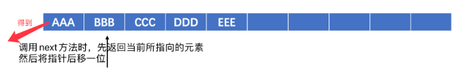

ArrayList和LinkedList各自的实现方式不同

ArrayList就是直接按下标访问:

```java
public E next() {
  	.....
    cursor = i + 1;  //移动指针
    return (E) elementData[lastRet = i];  //直接返回指针所指的元素
}
```

LinkedList就是不断向后寻找结点：

```java
public E next() {
    ...
    next = next.next;   //向后继续寻找结点
    nextIndex++;
    return lastReturned.item;  //返回结点内部存放的元素
}
```

因为这种设计，Iterator就可以直接使用而不用在意集合如何实现

> 注意
>
> ​	迭代器的使用是一次性的，用了之后就不能用了，如果需要再次进行遍历操作，那么需要重新生成一个迭代器对象。
>
> ​	为了简便，我们可以直接使用`foreach`语法来快速遍历集合类。

#### 新特性

java8 提供了一个Lambda表达式的forEach方法，这个方法接受一个Consumer，也就是对遍历的每一个元素进行操作：

```java
public static void main(String[] args) {
    List<String> list = Arrays.asList("A", "B", "C");
    list.forEach(System.out::println);
}
```

因为forEach方法内部本质上也是迭代器在处理，这个方法是在Iterable接口中定义的：

```java
default void forEach(Consumer<? super T> action) {
    Objects.requireNonNull(action);
    for (T t : this) {	//foreach语法遍历每一个元素
        action.accept(t);	//调用Consumer的accept来对每一个元素进行消费
    }
}
```

#### Iterable接口

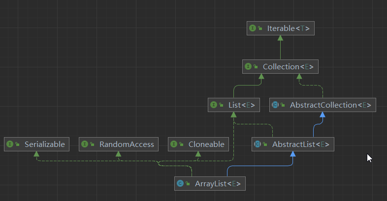

```java
//注意这个接口是集合接口的父接口，不要跟之前的迭代器接口搞混了
public interface Iterable<T> {
    //生成当前集合的迭代器，在Collection接口中重复定义了一次
    Iterator<T> iterator();

    //Java8新增方法，因为是在顶层接口中定义的，因此所有的集合类都有这个方法
    default void forEach(Consumer<? super T> action) {
        Objects.requireNonNull(action);
        for (T t : this) {
            action.accept(t);
        }
    }

    //这个方法会在多线程部分中进行介绍，暂时不做讲解
    default Spliterator<T> spliterator() {
        return Spliterators.spliteratorUnknownSize(iterator(), 0);
    }
}
```

#### ListIterator

这个迭代器是针对于List的强化版本，增加了更多方便的操作，因为List是有序集合，所以它支持两种方向的遍历操作，不仅能从前向后，也可以从后向前：

```java
public interface ListIterator<E> extends Iterator<E> {
    //原本就有的
    boolean hasNext();

    //原本就有的
    E next();

    //查看前面是否有已经遍历的元素
    boolean hasPrevious();

    //跟next相反，这里是倒着往回遍历
    E previous();

    //返回下一个待遍历元素的下标
    int nextIndex();

    //返回上一个已遍历元素的下标
    int previousIndex();

    //原本就有的
    void remove();

    //将上一个已遍历元素修改为新的元素
    void set(E e);

    //在遍历过程中，插入新的元素到当前待遍历元素之前
    void add(E e);
}
```

### Queue和Deque

LinkedList除了可以直接当做列表使用之外，还可以当做其他的数据结构使用，可以看到它不 仅仅实现了List接口：

```java
public class LinkedList<E>
    extends AbstractSequentialList<E>
    implements List<E>, Deque<E>, Cloneable, java.io.Serializable
{
```

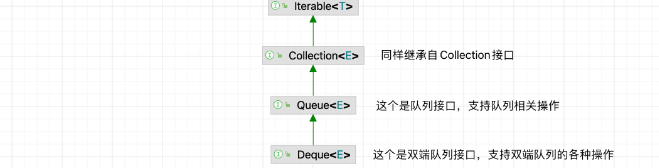

队列接口，它扩展了大量队列相关操作：

```java
public interface Queue<E> extends Collection<E> {
    //队列的添加操作，是在队尾进行插入（只不过List也是一样的，默认都是尾插）
  	//如果插入失败，会直接抛出异常
    boolean add(E e);

    //同样是添加操作，但是插入失败不会抛出异常
    boolean offer(E e);

    //移除队首元素，但是如果队列已经为空，那么会抛出异常
    E remove();

   	//同样是移除队首元素，但是如果队列为空，会返回null
    E poll();

    //仅获取队首元素，不进行出队操作，但是如果队列已经为空，那么会抛出异常
    E element();

    //同样是仅获取队首元素，但是如果队列为空，会返回null
    E peek();
}
```

因此，我们可以直接将一个LinkedList当作一个队列使用：

```java
public static void main(String[] args) {
    Queue<String> queue = new LinkedList<>();   //当做队列使用，还是很方便的
    queue.offer("AAA");
    queue.offer("BBB");
    System.out.println(queue.poll());
    System.out.println(queue.poll());
}
```

我们接着来看双端队列，实际上双端队列就是队列的升级版，我们一个普通的队列就是：

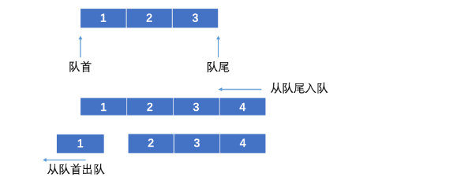

普通队列中从队尾入队，队首出队，而双端队列允许在队列的两端进行入队和出队操作：

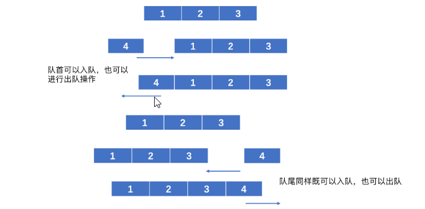

利用这种特性，双端队列既可以当做普通队列使用，也可以当做栈来使用，我们来看看Java中是如何定义的Deque双端队列接口的：

```java
//在双端队列中，所有的操作都有分别对应队首和队尾的
public interface Deque<E> extends Queue<E> {
    //在队首进行插入操作
    void addFirst(E e);

    //在队尾进行插入操作
    void addLast(E e);
		
  	//不用多说了吧？
    boolean offerFirst(E e);
    boolean offerLast(E e);

    //在队首进行移除操作
    E removeFirst();

    //在队尾进行移除操作
    E removeLast();

    //不用多说了吧？
    E pollFirst();
    E pollLast();

    //获取队首元素
    E getFirst();

    //获取队尾元素
    E getLast();

		//不用多说了吧？
    E peekFirst();
    E peekLast();

    //从队列中删除第一个出现的指定元素
    boolean removeFirstOccurrence(Object o);

    //从队列中删除最后一个出现的指定元素
    boolean removeLastOccurrence(Object o);

    // *** 队列中继承下来的方法操作是一样的，这里就不列出了 ***

    ...

    // *** 栈相关操作已经帮助我们定义好了 ***

    //将元素推向栈顶
    void push(E e);

    //将元素从栈顶出栈
    E pop();


    // *** 集合类中继承的方法这里也不多种介绍了 ***

    ...

    //生成反向迭代器，这个迭代器也是单向的，但是是next方法是从后往前进行遍历的
    Iterator<E> descendingIterator();

}
```

我们可以直接当做栈来进行使用：

```java
public static void main(String[] args) {
    Deque<String> deque = new LinkedList<>();
    deque.push("AAA");
    deque.push("BBB");
    System.out.println(deque.pop());
    System.out.println(deque.pop());
}
```

正向迭代器和反向迭代器：

```java
public static void main(String[] args) {
    Deque<String> deque = new LinkedList<>();
    deque.addLast("AAA");
    deque.addLast("BBB");
    Iterator<String> descendingIterator = deque.descendingIterator();
    System.out.println(descendingIterator.next());

    Iterator<String> iterator = deque.iterator();
    System.out.println(iterator.next());
}
```
当然，除了LinkedList实现了队列接口之外，还有其他的实现类，但是并不是很常用，这里做了解就行了：

```java
public static void main(String[] args) {
    Deque<String> deque = new ArrayDeque<>();   //数组实现的栈和队列
    Queue<String> queue = new PriorityQueue<>();  //优先级队列
}
```

这里需要介绍一下优先级队列，优先级队列可以根据每一个元素的优先级，对出队顺序进行调整，默认情况按照自然顺序：

```java
public static void main(String[] args) {
    Queue<Integer> queue = new PriorityQueue<>();
    queue.offer(10);
    queue.offer(4);
    queue.offer(5);
    System.out.println(queue.poll());
    System.out.println(queue.poll());
    System.out.println(queue.poll());
}
```

### Set集合

我们发现接口中定义的方法都是Collection中直接继承的，因此，Set支持的功能其实也就和Collection中定义的差不多，只不过：

- 不允许出现重复元素
- 不支持随机访问（不允许通过下标访问）

```java
public interface Set<E> extends Collection<E> {
    // Set集合中基本都是从Collection直接继承过来的方法，只不过对这些方法有更加特殊的定义
    int size();
    boolean isEmpty();
    boolean contains(Object o);
    Iterator<E> iterator();
    Object[] toArray();
    <T> T[] toArray(T[] a);

    //添加元素只有在当前Set集合中不存在此元素时才会成功，如果插入重复元素，那么会失败
    boolean add(E e);

    //这个同样是删除指定元素
    boolean remove(Object o);

    boolean containsAll(Collection<?> c);

    //同样是只能插入那些不重复的元素
    boolean addAll(Collection<? extends E> c);
  
    boolean retainAll(Collection<?> c);
    boolean removeAll(Collection<?> c);
    void clear();
    boolean equals(Object o);
    int hashCode();

    //这个方法我们同样会放到多线程中进行介绍
    @Override
    default Spliterator<E> spliterator() {
        return Spliterators.spliterator(this, Spliterator.DISTINCT);
    }
}
```

由于底层采用哈希表实现，所以说无法维持插入元素的顺序：

```java
public static void main(String[] args) {
    Set<String> set = new HashSet<>();
    set.addAll(Arrays.asList("A", "0", "-", "+"));
    System.out.println(set);
}
```


## 14 数据结构基础

**注意：**本部分内容难度很大，推荐计算机专业课程《数据结构与算法》作为前置学习课程。本部分介绍数据结构只是为了为后面的集合类型做准备。

学习集合类之前，我们还有最关键的内容需要学习，同第二章一样，自底向上才是最佳的学习方向，比起直接带大家认识集合类，不如先了解一下数据结构，只有了解了数据结构基础，才能更好地学习集合类，同时，数据结构也是你以后深入学习JDK源码的必备条件（学习不要快餐式）当然，我们主要是讲解Java，数据结构作为铺垫作用，所以我们只会讲解关键的部分，其他部分可以在数据结构与算法篇视频教程中详细学习。

> 在计算机科学中，数据结构是一种数据组织、管理和存储的格式,它可以帮助我们实现对数据高效的访问和修改。更准确地说,数据结构是数据值的集合，可以体现数据值之间的关系，以及可以对数据进行应用的函数或操作。

通俗地说，我们需要去学习在计算机中如何去更好地管理我们的数据，才能让我们对我们的数据控制更加灵活！


比如现在我们需要保存100个学生的数据，那么你首先想到的肯定是使用数组吧！没错，没有什么比数组更适合存放这100个学生的数据了，但是如果我们现在有了新的需求呢？我们不仅仅是存放这些数据，我们还希望能够将这些数据按顺序存放，支持在某个位置插入一条数据、删除一条数据、修改一条数据等，这时候，数组就显得有些乏力了。

数组无法做到这么高级的功能，那么我们就需要定义一种更加高级的数据结构来做到，我们可以使用线性表（Linear List）

> 线性表是由同一类型的数据元素构成的有序序列的线性结构。线性表中元素的个数就是线性表的长度，表的起始位置称为表头，表的结束位置称为表尾，当一个线性表中没有元素时，称为空表。

线性表一般需要包含以下功能：

* **获取指定位置上的元素：**直接获取线性表指定位置`i`上的元素。
* **插入元素：**在指定位置`i`上插入一个元素。
* **删除元素：**删除指定位置`i`上的一个元素。
* **获取长度：**返回线性表的长度。

也就是说，现在我们需要设计的是一种功能完善的表结构，它不像是数组那么低级，而是真正意义上的表：


简单来说它就是列表，比如我们的菜单，我们在点菜时就需要往菜单列表中添加菜品或是删除菜品，这时列表就很有用了，因为数组长度固定、操作简单，而我们添加菜品、删除菜品这些操作又要求长度动态变化、操作多样。

那么，如此高级的数据结构，我们该如何去实现呢？实现线性表的结构一般有两种，一种是顺序存储实现，还有一种是链式存储实现，我们先来看第一种，也是最简单的的一种。

### 线性表：顺序表

前面我们说到，既然数组无法实现这样的高级表结构，那么我就基于数组，对其进行强化，也就是说，我们存放数据还是使用数组，但是我们可以为其编写一些额外的操作来强化为线性表，像这样底层依然采用顺序存储实现的线性表，我们称为顺序表。


这里我们可以先定义一个新的类型：

```java
public class ArrayList<E> {   //泛型E，因为表中要存的具体数据类型待定
    int capacity = 10;   //当前顺序表的容量
  	int size = 0;   //当前已经存放的元素数量
    private Object[] array = new Object[capacity];   //底层存放数据的数组
}
```

顺序表的插入和删除操作，其实就是：


当插入元素时，需要将插入位置给腾出来，也就是将后面的所有元素向后移，同样的，如果要删除元素，那么也需要将所有的元素向前移动，顺序表是紧凑的，不能出现空位。

所以说我们可以来尝试实现一下，首先是插入方法：

```java
public void add(E element, int index){   //插入方法需要支持在指定下标位置插入
    for (int i = size; i > index; i--)   //从后往前，一个一个搬运元素
        array[i] = array[i - 1];
    array[index] = element;   //腾出位置之后，直接插入元素放到对应位置上
    size++;   //插入完成之后，记得将size自增
}
```

只不过这样并不完美，因为我们的插入操作并不是在任何位置都支持插入的，我们允许插入的位置只能是 [0, size] 这个范围内


所以说我们需要在插入之前进行判断：

```java
public void add(E element, int index){
    if(index < 0 || index > size)    //插入之前先判断插入位置是否合法
        throw new IndexOutOfBoundsException("插入位置非法，合法的插入位置为：0 ~ "+size);
    for (int i = size; i > index; i--)
        array[i] = array[i - 1];
    array[index] = element;
    size++;
}
```

我们来测试一下吧：

```java
public static void main(String[] args) {
    ArrayList<Integer> list = new ArrayList<>();
    list.add(10, 1);    //一上来只能在第一个位置插入，第二个位置肯定是非法的
}
```

于是就成功得到异常：


只不过依然不够完美，万一我们的顺序表装满了咋办？所以说，我们在插入元素之前，需要进行判断，如果已经装满了，那么我们需要先扩容之后才能继续插入新的元素：

```java
public void add(E element, int index){
    if(index < 0 || index > size)
        throw new IndexOutOfBoundsException("插入位置非法，合法的插入位置为：0 ~ "+size);
    if(capacity == size) {
        int newCapacity = capacity + (capacity >> 1);   //扩容规则就按照原本容量的1.5倍来吧
        Object[] newArray = new Object[newCapacity];    //创建一个新的数组来存放更多的元素
        System.arraycopy(array, 0, newArray, 0, size);   //使用arraycopy快速拷贝原数组内容到新的数组
        array = newArray;   //更换为新的数组
      	capacity = newCapacity;   //容量变成扩容之后的
    }
    for (int i = size; i > index; i--)
        array[i] = array[i - 1];
    array[index] = element;
    size++;
}
```

我们来重写一下`toString`方法打印当前存放的元素：

```java
public String toString() {
    StringBuilder builder = new StringBuilder();
    for (int i = 0; i < size; i++) builder.append(array[i]).append(" ");
    return builder.toString();
}
```

可以看到，我们的底层数组会自动扩容，便于我们使用：

```java
public static void main(String[] args) {
    ArrayList<Integer> list = new ArrayList<>();
    for (int i = 0; i < 20; i++)
        list.add(i, i);
    System.out.println(list);
}
```


我们接着来看删除操作，其实操作差不多，只需要将后面的覆盖到前面就可以了：

```java
@SuppressWarnings("unchecked")   //屏蔽未经检查警告
public E remove(int index){   //删除对应位置上的元素，注意需要返回被删除的元素
    E e = (E) array[index];   //因为存放的是Object类型，这里需要强制类型转换为E
    for (int i = index; i < size; i++)   //从前往后，挨个往前搬一位
        array[i] = array[i + 1];
    size--;    //删完记得将size--
    return e;
}
```

同样的，我们需要对删除的合法范围进行判断：


所以说我们也来进行一下判断：

```java
@SuppressWarnings("unchecked")
public E remove(int index){
    if(index < 0 || index > size - 1)
        throw new IndexOutOfBoundsException("删除位置非法，合法的插入位置为：0 ~ "+(size - 1));
    E e = (E) array[index];
    for (int i = index; i < size; i++)
        array[i] = array[i + 1];
    size--;
    return e;
}
```

因为删除不需要考虑容量的问题，所以说这里的删除操作就编写完成了。

当然，我们还得支持获取指定下标位置上的元素，这个就简单了，直接从数组中那就行了：

```java
@SuppressWarnings("unchecked")
public E get(int index){
    if(index < 0 || index > size - 1)   //在插入之前同样要进行范围检查
        throw new IndexOutOfBoundsException("非法的位置，合法的位置为：0 ~ "+(size - 1));
    return (E) array[index];   //直接返回就完事
}

public int size(){   //获取当前存放的元素数量
    return size;
}
```

是不是感觉顺便表其实还是挺简单的，也就是一个数组多了一些操作罢了。

### 线性表：链表

前面我们介绍了如何使用数组实现线性表，我们接着来看第二种方式，我们可以使用链表来实现，那么什么是链表呢？


链表不同于顺序表，顺序表底层采用数组作为存储容器，需要分配一块连续且完整的内存空间进行使用，而链表则不需要，它通过一个指针来连接各个分散的结点，形成了一个链状的结构，每个结点存放一个元素，以及一个指向下一个结点的指针，通过这样一个一个相连，最后形成了链表。它不需要申请连续的空间，只需要按照顺序连接即可，虽然物理上可能不相邻，但是在逻辑上依然是每个元素相邻存放的，这样的结构叫做链表（单链表）。

链表分为带头结点的链表和不带头结点的链表，戴头结点的链表就是会有一个头结点指向后续的整个链表，但是头结点不存放数据：


而不带头结点的链表就像上面那样，第一个节点就是存放数据的结点，一般设计链表都会采用带头结点的结构，因为操作更加方便。

我们来尝试定义一下：

```java
public class LinkedList<E> {
  	//链表的头结点，用于连接之后的所有结点
    private final Node<E> head = new Node<>(null);
  	private int size = 0;   //当前的元素数量还是要存一下，方便后面操作
    
    private static class Node<E> {  //结点类，仅供内部使用
        E element;   //每个结点都存放元素
        Node<E> next;   //以及指向下一个结点的引用
      
      	public Node(E element) {
            this.element = element;
        }
    }
}
```

接着我们来设计一下链表的插入和删除，我们前面实现了顺序表的插入，那么链表的插入该怎么做呢？


我们可以先修改新插入的结点的后继结点（也就是下一个结点）指向，指向原本在这个位置的结点：


接着我们可以将前驱结点（也就是上一个结点）的后继结点指向修改为我们新插入的结点：


这样，我们就成功插入了一个新的结点，现在新插入的结点到达了原本的第二个位置上：


按照这个思路，我们来实现一下，首先设计一下方法：

```java
public void add(E element, int index){
    Node<E> prev = head;   //先找到对应位置的前驱结点
    for (int i = 0; i < index; i++) 
        prev = prev.next;
    Node<E> node = new Node<>(element);   //创建新的结点
    node.next = prev.next;   //先让新的节点指向原本在这个位置上的结点
    prev.next = node;   //然后让前驱结点指向当前结点
    size++;   //完事之后一样的，更新size
}
```

我们来重写一下toString方法看看能否正常插入：

```java
@Override
public String toString() {
    StringBuilder builder = new StringBuilder();
    Node<E> node = head.next;   //从第一个结点开始，一个一个遍历，遍历一个就拼接到字符串上去
    while (node != null) {
        builder.append(node.element).append(" ");
        node = node.next;
    }
    return builder.toString();
}
```

可以看到我们的插入操作是可以正常工作的：

```java
public static void main(String[] args) {
    LinkedList<Integer> list = new LinkedList<>();
    list.add(10, 0);
    list.add(30, 0);
    list.add(20, 1);
    System.out.println(list);
}
```


只不过还不够完美，跟之前一样，我们还得考虑插入位置是否合法：

```java
public void add(E element, int index){
    if(index < 0 || index > size)
        throw new IndexOutOfBoundsException("插入位置非法，合法的插入位置为：0 ~ "+size);
    Node<E> prev = head;
    for (int i = 0; i < index; i++)
        prev = prev.next;
    Node<E> node = new Node<>(element);
    node.next = prev.next;
    prev.next = node;
    size++;
}
```

插入操作完成之后，我们接着来看删除操作，那么我们如何实现删除操作呢？实际上也会更简单一些，我们可以直接将待删除节点的前驱结点指向修改为待删除节点的下一个：


这样，在逻辑上来说，待删除结点其实已经不在链表中了，所以我们只需要释放掉待删除结点占用的内存空间就行了：


那么我们就按照这个思路来编写一下程序：

```java
public E remove(int index){
    if(index < 0 || index > size - 1)   //同样的，先判断位置是否合法
        throw new IndexOutOfBoundsException("删除位置非法，合法的删除位置为：0 ~ "+(size - 1));
    Node<E> prev = head;
    for (int i = 0; i < index; i++)   //同样需要先找到前驱结点
        prev = prev.next;
    E e = prev.next.element;   //先把待删除结点存放的元素取出来
    prev.next = prev.next.next;  //可以删了
    size--;   //记得size--
    return e;
}
```

是不是感觉还是挺简单的？这样，我们就成功完成了链表的删除操作。

我们接着来实现一下获取对应位置上的元素：

```java
public E get(int index){
    if(index < 0 || index > size - 1)
        throw new IndexOutOfBoundsException("非法的位置，合法的位置为：0 ~ "+(size - 1));
    Node<E> node = head;
    while (index-- >= 0)   //这里直接让index减到-1为止
        node = node.next;
    return node.element;
}

public int size(){
    return size;
}
```

这样，我们的链表就编写完成了，实际上只要理解了那种结构，其实还是挺简单的。

**问题**：什么情况下使用顺序表，什么情况下使用链表呢？

* 通过分析顺序表和链表的特性我们不难发现，链表在随机访问元素时，需要通过遍历来完成，而顺序表则利用数组的特性直接访问得到，所以，当我们读取数据多于插入或是删除数据的情况下时，使用顺序表会更好。
* 而顺序表在插入元素时就显得有些鸡肋了，因为需要移动后续元素，整个移动操作会浪费时间，而链表则不需要，只需要修改结点 指向即可完成插入，所以在频繁出现插入或删除的情况下，使用链表会更好。

虽然单链表使用起来也比较方便，不过有一个问题就是，如果我们想要操作某一个结点，比如删除或是插入，那么由于单链表的性质，我们只能先去找到它的前驱结点，才能进行。为了解决这种查找前驱结点非常麻烦的问题，我们可以让结点不仅保存指向后续结点的指针，同时也保存指向前驱结点的指针：


这样我们无论在哪个结点，都能够快速找到对应的前驱结点，就很方便了，这样的链表我们成为双向链表（双链表）

### 线性表：栈

栈（也叫堆栈，Stack）是一种特殊的线性表，它只能在在表尾进行插入和删除操作，就像下面这样：


也就是说，我们只能在一端进行插入和删除，当我们依次插入1、2、3、4这四个元素后，连续进行四次删除操作，删除的顺序刚好相反：4、3、2、1，我们一般将其竖着看：


底部称为栈底，顶部称为栈顶，所有的操作只能在栈顶进行，也就是说，被压在下方的元素，只能等待其上方的元素出栈之后才能取出，就像我们往箱子里里面放的书一样，因为只有一个口取出里面的物品，所以被压在下面的书只能等上面的书被拿出来之后才能取出，这就是栈的思想，它是一种先进后出的数据结构（FILO，First In, Last Out）

实现栈也是非常简单的，可以基于我们前面的顺序表或是链表，这里我们需要实现两个新的操作：

* pop：出栈操作，从栈顶取出一个元素。
* push：入栈操作，向栈中压入一个新的元素。

栈可以使用顺序表实现，也可以使用链表实现，这里我们就使用链表，实际上使用链表会更加的方便，我们可以直接将头结点指向栈顶结点，而栈顶结点连接后续的栈内结点：


当有新的元素入栈，只需要在链表头部插入新的结点即可，我们来尝试编写一下：

```java
public class LinkedStack<E> {

    private final Node<E> head = new Node<>(null);   //大体内容跟链表类似

    private static class Node<E> {
        E element;
        Node<E> next;

        public Node(E element) {
            this.element = element;
        }
    }
}
```

接着我们来编写一下入栈操作：


代码如下：

```java
public void push(E element){
    Node<E> node = new Node<>(element);   //直接创建新结点
    node.next = head.next;    //新结点的下一个变成原本的栈顶结点
    head.next = node;     //头结点的下一个改成新的结点
}
```

这样，我们就可以轻松实现入栈操作了。其实出栈也是同理，所以我们只需要将第一个元素移除即可：

```java
public E pop(){
  	if(head.next == null)   //如果栈已经没有元素了，那么肯定是没办法取的
      	throw new NoSuchElementException("栈为空");
    E e = head.next.element;   //先把待出栈元素取出来
    head.next = head.next.next;   //直接让头结点的下一个指向下一个的下一个
    return e;
}
```

我们来测试一下吧：

```java
public static void main(String[] args) {
    LinkedStack<String> stack = new LinkedStack<>();
    stack.push("AAA");
    stack.push("BBB");
    stack.push("CCC");
    System.out.println(stack.pop());
    System.out.println(stack.pop());
    System.out.println(stack.pop());
}
```

可以看到，入栈顺序和出栈顺序是完全相反的：


其实还是挺简单的。

### 线性表：队列

前面我们学习了栈，栈中元素只能栈顶出入，它是一种特殊的线性表，同样的，队列（Queue）也是一种特殊的线性表。

就像我们在超市、食堂需要排队一样，我们总是排成一列，先到的人就排在前面，后来的人就排在后面，越前面的人越先完成任务，这就是队列，队列有队头和队尾：


秉承先来后到的原则，队列中的元素只能从队尾进入，只能从队首出去，也就是说，入队顺序为1、2、3、4，那么出队顺序也一定是1、2、3、4，所以队列是一种先进先出（FIFO，First In, First Out）的数据结构。

队列也可以使用链表和顺序表来实现，只不过使用链表的话就不需要关心容量之类的问题了，会更加灵活一些：


注意我们需要同时保存队首和队尾两个指针，因为是单链表，所以队首需要存放指向头结点的指针，因为需要的是前驱结点，而队尾则直接是指向尾结点的指针即可，后面只需要直接在后面拼接就行。

当有新的元素入队时，只需要拼在队尾就行了，同时队尾指针也要后移一位：


出队时，只需要移除队首指向的下一个元素即可：


那么我们就按照这个思路，来编写一下代码吧：

```java
public class LinkedQueue<E> {

    private final Node<E> head = new Node<>(null);

    public void offer(E element){  //入队操作
        Node<E> last = head;
        while (last.next != null)   //入队直接丢到最后一个结点的屁股后面就行了
            last = last.next;
        last.next = new Node<>(element);
    }

    public E poll(){   //出队操作
        if(head.next == null)   //如果队列已经没有元素了，那么肯定是没办法取的
            throw new NoSuchElementException("队列为空");
        E e = head.next.element;
        head.next = head.next.next;   //直接从队首取出
        return e;
    }

    private static class Node<E> {
        E element;
        Node<E> next;

        public Node(E element) {
            this.element = element;
        }
    }
}
```

其实使用起来还是挺简单的，我们来测试一下吧：

```java
public static void main(String[] args) {
    LinkedQueue<String> stack = new LinkedQueue<>();
    stack.offer("AAA");
    stack.offer("BBB");
    stack.offer("CCC");
    System.out.println(stack.poll());
    System.out.println(stack.poll());
    System.out.println(stack.poll());
}
```


可以看到，队列遵从先进先出，入队顺序和出队顺序是一样的。

### 树：二叉树

树是一种全新的数据结构，它就像一棵树的树枝一样，不断延伸。


在我们的程序中，想要表示出一棵树，就可以像下面这样连接：


可以看到，现在一个结点下面可能会连接多个节点，并不断延伸，就像树枝一样，每个结点都有可能是一个分支点，延伸出多个分支，从位于最上方的结点开始不断向下，而这种数据结构，我们就称为**树**（Tree）注意分支只能向后单独延伸，之后就分道扬镳了，**不能与其他分支上的结点相交！**

* 我们一般称位于最上方的结点为树的**根结点**（Root）因为整棵树正是从这里开始延伸出去的。
* 每个结点连接的子结点数目（分支的数目），我们称为结点的**度**（Degree），而各个结点度的最大值称为树的度。
* 每个结点延伸下去的下一个结点都可以称为一棵**子树**（SubTree）比如结点`B`及其之后延伸的所有分支合在一起，就是一棵`A`的子树。
* 每个**结点的层次**（Level）按照从上往下的顺序，树的根结点为`1`，每向下一层`+1`，比如`G`的层次就是`3`，整棵树中所有结点的最大层次，就是这颗**树的深度**（Depth），比如上面这棵树的深度为4，因为最大层次就是4。

由于整棵树错综复杂，所以说我们需要先规定一下结点之间的称呼，就像族谱那样：

* 与当前结点直接向下相连的结点，我们称为**子结点**（Child），比如`B、C、D`结点，都是`A`的子结点，就像族谱中的父子关系一样，下一代一定是子女，相反的，那么`A`就是`B、C、D`的**父结点**（Parent），也可以叫双亲结点。
* 如果某个节点没有任何的子结点（结点度为0时）那么我们称这个结点为**叶子结点**（因为已经到头了，后面没有分支了，这时就该树枝上长叶子了那样）比如`K、L、F、G、M、I、J`结点，都是叶子结点。
* 如果两个结点的父结点是同一个，那么称这两个节点为**兄弟结点**（Sibling）比如`B`和`C`就是兄弟结点，因为都是`A`的孩子。
* 从根结点开始一直到某个结点的整条路径的所有结点，都是这个结点的**祖先结点**（Ancestor）比如`L`的祖先结点就是`A、B、E`

那么在了解了树的相关称呼之后，相信各位就应该对树有了一定的了解，虽然概念比较多，但是还请各位一定记住，不然后面就容易听懵。

而我们本章需要着重讨论的是**二叉树**（Binary Tree）它是一种特殊的树，它的度最大只能为`2`，所以我们称其为二叉树，一棵二叉树大概长这样：


并且二叉树任何结点的子树是有左右之分的，不能颠倒顺序，比如A结点左边的子树，称为左子树，右边的子树称为右子树。

当然，对于某些二叉树我们有特别的称呼，比如，在一棵二叉树中，所有分支结点都存在左子树和右子树，且叶子结点都在同一层：


这样的二叉树我们称为**满二叉树**，可以看到整棵树都是很饱满的，没有出现任何度为1的结点，当然，还有一种特殊情况：


可以看到只有最后一层有空缺，并且所有的叶子结点是按照从左往右的顺序排列的，这样的二叉树我们一般称其为**完全二叉树**，所以，一棵满二叉树，一定是一棵完全二叉树。

我们接着来看看二叉树在程序中的表示形式，我们在前面使用链表的时候，每个结点不仅存放对应的数据，而且会存放一个指向下一个结点的引用：


而二叉树也可以使用这样的链式存储形式，只不过现在一个结点需要存放一个指向左子树的引用和一个指向右子树的引用了：


通过这种方式，我们就可以通过连接不同的结点形成一颗二叉树了，这样也更便于我们去理解它，我们首先定义一个类：

```java
public class TreeNode<E> {
    public E element;
    public TreeNode<E> left, right;

    public TreeNode(E element){
        this.element = element;
    }
}
```

比如我们现在想要构建一颗像这样的二叉树：


首先我们需要创建好这几个结点：

```java
public static void main(String[] args) {
    TreeNode<Character> a = new TreeNode<>('A');
    TreeNode<Character> b = new TreeNode<>('B');
    TreeNode<Character> c = new TreeNode<>('C');
    TreeNode<Character> d = new TreeNode<>('D');
    TreeNode<Character> e = new TreeNode<>('E');
    
}
```

接着我们从最上面开始，挨着进行连接，首先是A这个结点：

```java
public static void main(String[] args) {
    ...
    a.left = b;
    a.right = c;
    b.left = d;
    b.right = e;
}
```

这样的话，我们就成功构建好了这棵二叉树，比如现在我们想通过根结点访问到D：

```java
System.out.println(a.left.left.element);
```

断点调试也可以看的很清楚：


这样，我们就通过使用链式结构，成功构建出了一棵二叉树。

接着我们来看看如何遍历一棵二叉树，也就是说我们想要访问二叉树的每一个结点，由于树形结构特殊，遍历顺序并不唯一，所以一共有四种访问方式：**前序遍历、中序遍历、后序遍历、层序遍历。**不同的访问方式输出都结点顺序也不同。

首先我们来看最简单的前序遍历：


前序遍历是一种勇往直前的态度，走到哪就遍历到那里，先走左边再走右边，比如上面的这个图，首先会从根节点开始：


从A开始，先左后右，那么下一个就是B，然后继续走左边，是D，现在ABD走完之后，B的左边结束了，那么就要开始B的右边了，所以下一个是E，E结束之后，现在A的左子树已经全部遍历完成了，然后就是右边，接着就是C，C没有左子树了，那么只能走右边了，最后输出F，所以上面这个二叉树的前序遍历结果为：ABDECF

1. 打印根节点
2. 前序遍历左子树
3. 前序遍历右子树

我们不难发现规律，整棵二叉树（包括子树）的根节点一定是出现在最前面的，比如A在最前面，A的左子树根结点B也是在最前面的。我们现在就来尝试编写一下代码实现一下，先把二叉树构建出来：

```java
public static void main(String[] args) {
    TreeNode<Character> a = new TreeNode<>('A');
    TreeNode<Character> b = new TreeNode<>('B');
    TreeNode<Character> c = new TreeNode<>('C');
    TreeNode<Character> d = new TreeNode<>('D');
    TreeNode<Character> e = new TreeNode<>('E');
    TreeNode<Character> f = new TreeNode<>('F');
    a.left = b;
    a.right = c;
    b.left = d;
    b.right = e;
    c.right = f;
}
```

组装好之后，我们来实现一下前序遍历的方法：

```java
private static <T> void preOrder(TreeNode<T> root){
    System.out.print(root.element + " ");   //首先肯定要打印，这个是必须的
}
```

打印完成之后，我们就按照先左后右的规则往后遍历下一个结点，这里我们就直接使用递归来完成：

```java
private static <T> void preOrder(TreeNode<T> root){
    System.out.print(root.element + " ");
    preOrder(root.left);    //先走左边
    preOrder(root.right);   //再走右边
}
```

不过还没完，我们的递归肯定是需要一个终止条件的，不可能无限地进行下去，如果已经走到底了，那么就不能再往下走了，所以：

```java
private static <T> void preOrder(TreeNode<T> root){
    if(root == null) return;
    System.out.print(root.element);
    preOrder(root.left);
    preOrder(root.right);
}
```

最后我们来测试一下吧：

```java
public static void main(String[] args) {
    ...
    preOrder(a);
}
```

可以看到结果为：


这样我们就通过一个简单的递归操作完成了对一棵二叉树的前序遍历，如果不太好理解，建议结合调试进行观察。

那么前序遍历我们了解完了，接着就是中序遍历了，中序遍历在顺序上与前序遍历不同，前序遍历是走到哪就打印到哪，而中序遍历需要先完成整个左子树的遍历后再打印，然后再遍历其右子树。

我们还是以上面的二叉树为例：


首先需要先不断遍历左子树，走到最底部，但是沿途并不进行打印，而是到底之后，再打印，所以第一个打印的是D，接着由于没有右子树，所以我们回到B，此时再打印B，然后再去看B的右结点E，由于没有左子树和右子树了，所以直接打印E，左边遍历完成，接着回到A，打印A，然后对A的右子树重复上述操作。所以说遍历的基本规则还是一样的，只是打印值的时机发生了改变。

1. 中序遍历左子树
2. 打印结点
3. 中序遍历右子树

所以这棵二叉树的中序遍历结果为：DBEACF，我们可以发现一个规律，就是在某个结点的左子树中所有结点，其中序遍历结果也是按照这样的规律排列的，比如A的左子树中所有结点，中序遍历结果中全部都在A的左边，右子树中所有的结点，全部都在A的右边（这个规律很关键，后面在做一些算法题时会用到）

那么怎么才能将打印调整到左子树全部遍历结束之后呢？其实很简单：

```java
private static <T> void inOrder(TreeNode<T> root){
    if(root == null) return;
    inOrder(root.left);    //先完成全部左子树的遍历
    System.out.print(root.element);    //等待左子树遍历完成之后再打印
    inOrder(root.right);    //然后就是对右子树进行遍历
}
```

我们只需要将打印放到左子树遍历之后即可，这样打印出来的结果就是中序遍历的结果了：


这样，我们就实现了二叉树的中序遍历，实际上还是很好理解的。

接着我们来看一下后序遍历，后序遍历继续将打印的时机延后，需要等待左右子树全部遍历完成，才会去进行打印。


首先还是一路向左，到达结点D，此时结点D没有左子树了，接着看结点D还有没有右子树，发现也没有，左右子树全部遍历完成，那么此时再打印D，同样的，D完事之后就回到B了，此时接着看B的右子树，发现有结点E，重复上述操作，E也打印出来了，接着B的左右子树全部OK，那么再打印B，接着A的左子树就完事了，现在回到A，看到A的右子树，继续重复上述步骤，当A的右子树也遍历结束后，最后再打印A结点。

1. 后序遍历左子树
2. 后序遍历右子树
3. 打印结点

所以最后的遍历顺序为：DEBFCA，不难发现，整棵二叉树（包括子树）根结点一定是在后面的，比如A在所有的结点的后面，B在其子节点D、E的后面，这一点恰恰和前序遍历相反（注意不是得到的结果相反，是规律相反）

所以，按照这个思路，我们来编写一下后序遍历：

```java
private static <T> void postOrder(TreeNode<T> root){
    if(root == null) return;
    postOrder(root.left);
    postOrder(root.right);
    System.out.print(root.element);  //时机延迟到最后
}
```

结果如下：


最后我们来看层序遍历，实际上这种遍历方式是我们人脑最容易理解的，它是按照每一层在进行遍历：


层序遍历实际上就是按照从上往下每一层，从左到右的顺序打印每个结点，比如上面的这棵二叉树，那么层序遍历的结果就是：ABCDEF，像这样一层一层的挨个输出。

虽然理解起来比较简单，但是如果让你编程写出来，该咋搞？是不是感觉有点无从下手？

我们可以利用队列来实现层序遍历，首先将根结点存入队列中，接着循环执行以下步骤：

* 进行出队操作，得到一个结点，并打印结点的值。
* 将此结点的左右孩子结点依次入队。

不断重复以上步骤，直到队列为空。

我们来分析一下，首先肯定一开始A在里面：


接着开始不断重复上面的步骤，首先是将队首元素出队，打印A，然后将A的左右孩子依次入队：


现在队列中有B、C两个结点，继续重复上述操作，B先出队，打印B，然后将B的左右孩子依次入队：


现在队列中有C、D、E这三个结点，继续重复，C出队并打印，然后将F入队：


我们发现，这个过程中，打印的顺序正好就是我们层序遍历的顺序，所以说队列还是非常有用的，这里我们可以直接把之前的队列拿来用。那么现在我们就来上代码吧，首先是之前的队列：

```java
public class LinkedQueue<E> {

    private final Node<E> head = new Node<>(null);

    public void offer(E element){
        Node<E> last = head;
        while (last.next != null)
            last = last.next;
        last.next = new Node<>(element);
    }

    public E poll(){
        if(head.next == null)
            throw new NoSuchElementException("队列为空");
        E e = head.next.element;
        head.next = head.next.next;
        return e;
    }
    
    public boolean isEmpty(){   //这里多写了一个判断队列为空的操作，方便之后使用
        return head.next == null;   //直接看头结点后面还有没有东西就行了
    }

    private static class Node<E> {
        E element;
        Node<E> next;

        public Node(E element) {
            this.element = element;
        }
    }
}
```

我们来尝试编写一下层序遍历：

```java
private static <T> void levelOrder(TreeNode<T> root){
    LinkedQueue<TreeNode<T>> queue = new LinkedQueue<>();  //创建一个队列
    queue.offer(root);    //将根结点丢进队列
    while (!queue.isEmpty()) {   //如果队列不为空，就一直不断地取出来
        TreeNode<T> node = queue.poll();   //取一个出来
        System.out.print(node.element);  //打印
        if(node.left != null) queue.offer(node.left);   //如果左右孩子不为空，直接将左右孩子丢进队列
        if(node.right != null) queue.offer(node.right);
    }
}
```

可以看到结果就是层序遍历的结果：


当然，使用递归也可以实现，但是需要单独存放结果然后单独输出，不是很方便，所以说这里就不演示了。

### 树：二叉查找树和平衡二叉树

**注意：**本部分只进行理论介绍，不做代码实现。

还记得我们开篇讲到的二分搜索算法吗？通过不断缩小查找范围，最终我们可以以很高的效率找到有序数组中的目标位置。而二叉查找树则利用了类似的思想，我们可以借助其来像二分搜索那样快速查找。

**二叉查找树**也叫二叉搜索树或是二叉排序树，它具有一定的规则：

* 左子树中所有结点的值，均小于其根结点的值。
* 右子树中所有结点的值，均大于其根结点的值。
* 二叉搜索树的子树也是二叉搜索树。

一棵二叉搜索树长这样：


这棵树的根结点为18，而其根结点左边子树的根结点为10，包括后续结点，都是满足上述要求的。二叉查找树满足左边一定比当前结点小，右边一定比当前结点大的规则，比如我们现在需要在这颗树种查找值为15的结点：

1. 从根结点18开始，因为15小于18，所以从左边开始找。
2. 接着来到10，发现10比15小，所以继续往右边走。
3. 来到15，成功找到。

实际上，我们在对普通二叉树进行搜索时，可能需要挨个进行查看比较，而有了二叉搜索树，查找效率就大大提升了，它就像我们前面的二分搜索那样。

利用二叉查找树，我们在搜索某个值的时候，效率会得到巨大提升。但是虽然看起来比较完美，也是存在缺陷的，比如现在我们依次将下面的值插入到这棵二叉树中：

```
20 15 13 8 6 3
```

在插入完成后，我们会发现这棵二叉树竟然长这样：


因为根据我们之前编写的插入规则，小的一律往左边放，现在正好来的就是这样一串递减的数字，最后就组成了这样的一棵只有一边的二叉树，这种情况，与其说它是一棵二叉树，不如说就是一个链表，如果这时我们想要查找某个结点，那么实际上查找的时间并没有得到任何优化，直接就退化成线性查找了。

所以，二叉查找树只有在理想情况下，查找效率才是最高的，而像这种极端情况，就性能而言几乎没有任何的提升。我们理想情况下，这样的效率是最高的：


所以，我们在进行结点插入时，需要尽可能地避免这种一边倒的情况，这里就需要引入**平衡二叉树**的概念了。实际上我们发现，在插入时如果不去维护二叉树的平衡，某一边只会无限制地延伸下去，出现极度不平衡的情况，而我们理想中的二叉查找树左右是尽可能保持平衡的，**平衡二叉树**（AVL树）就是为了解决这样的问题而生的。

它的性质如下：

* 平衡二叉树一定是一棵二叉查找树。
* 任意结点的左右子树也是一棵平衡二叉树。
* 从根节点开始，左右子树都高度差不能超过1，否则视为不平衡。

可以看到，这些性质规定了平衡二叉树需要保持高度平衡，这样我们的查找效率才不会因为数据的插入而出现降低的情况。二叉树上节点的左子树高度 减去 右子树高度， 得到的结果称为该节点的**平衡因子**（Balance Factor），比如：


通过计算平衡因子，我们就可以快速得到是否出现失衡的情况。比如下面的这棵二叉树，正在执行插入操作：


可以看到，当插入之后，不再满足平衡二叉树的定义时，就出现了失衡的情况，而对于这种失衡情况，为了继续保持平衡状态，我们就需要进行处理了。我们可能会遇到以下几种情况导致失衡：


根据插入结点的不同偏向情况，分为LL型、LR型、RR型、RL型。针对于上面这几种情况，我们依次来看一下如何进行调整，使得这棵二叉树能够继续保持平衡：

动画网站：https://www.cs.usfca.edu/~galles/visualization/AVLtree.html（实在不理解可以看看动画是怎么走的）

1. **LL型调整**（右旋）

    

    首先我们来看这种情况，这是典型的LL型失衡，为了能够保证二叉树的平衡，我们需要将其进行**旋转**来维持平衡，去纠正最小不平衡子树即可。那么怎么进行旋转呢？对于LL型失衡，我们只需要进行右旋操作，首先我们先找到最小不平衡子树，注意是最小的那一个：

    

    可以看到根结点的平衡因子是2，是目前最小的出现不平衡的点，所以说从根结点开始向左的三个结点需要进行右旋操作，右旋需要将这三个结点中间的结点作为新的根结点，而其他两个结点现在变成左右子树：

    

    这样，我们就完成了右旋操作，可以看到右旋之后，所有的结点继续保持平衡，并且依然是一棵二叉查找树。

2. **RR型调整**（左旋）

    前面我们介绍了LL型以及右旋解决方案，相反的，当遇到RR型时，我们只需要进行左旋操作即可：

    

    操作和上面是一样的，只不过现在反过来了而已：

    

    这样，我们就完成了左旋操作，使得这棵二叉树继续保持平衡状态了。

3. **RL型调整**（先右旋，再左旋）

    剩下两种类型比较麻烦，需要旋转两次才行。我们来看看RL型长啥样：

    

    可以看到现在的形状是一个回旋镖形状的，先右后左的一个状态，也就是RL型，针对于这种情况，我们需要先进行右旋操作，注意这里的右旋操作针对的是后两个结点：

    

    其中右旋和左旋的操作，与之前一样，该怎么分配左右子树就怎么分配，完成两次旋转后，可以看到二叉树重新变回了平衡状态。

4. **LR型调整**（先左旋，再右旋）

    和上面一样，我们来看看LR型长啥样，其实就是反着的：

    

    形状是先向左再向右，这就是典型的LR型了，我们同样需要对其进行两次旋转：

    

    这里我们先进行的是左旋，然后再进行的右旋，这样二叉树就能继续保持平衡了。

这样，我们只需要在插入结点时注意维护整棵树的平衡因子，保证其处于稳定状态，这样就可以让这棵树一直处于高度平衡的状态，不会再退化了。

### 树：红黑树

**注意：**本部分只进行理论介绍，不做代码实现。

很多人都说红黑树难，其实就那几条规则，跟着我推一遍其实还是很简单的，当然前提是一定要把前面的平衡二叉树搞明白。

前面我们讲解了二叉平衡树，通过在插入结点时维护树的平衡，这样就不会出现极端情况使得整棵树的查找效率急剧降低了。但是这样是否开销太大了一点，因为一旦平衡因子的绝对值超过1那么就失衡，这样每插入一个结点，就有很大的概率会导致失衡，我们能否不这么严格，但同时也要在一定程度上保证平衡呢？这就要提到红黑树了。

在线动画网站：https://www.cs.usfca.edu/~galles/visualization/RedBlack.html

红黑树也是二叉查找树的一种，它大概长这样，可以看到结点有红有黑：


它并不像平衡二叉树那样严格要求高度差不能超过1，而是只需要满足五个规则即可，它的规则如下：

- 规则1：每个结点可以是黑色或是红色。
- 规则2：根结点一定是黑色。
- 规则3：红色结点的父结点和子结点不能为红色，也就是说不能有两个连续的红色。
- 规则4：所有的空结点都是黑色（空结点视为NIL，红黑树中是将空节点视为叶子结点）
- 规则5：每个结点到空节点（NIL）路径上出现的黑色结点的个数都相等。

它相比平衡二叉树，通过不严格平衡和改变颜色，就能在一定程度上减少旋转次数，这样的话对于整体性能是有一定提升的，只不过我们在插入结点时，就有点麻烦了，我们需要同时考虑变色和旋转这两个操作了，但是会比平衡二叉树更简单。

那么什么时候需要变色，什么时候需要旋转呢？我们通过一个简单例子来看看：


首先这棵红黑树只有一个根结点，因为根结点必须是黑色，所以说直接变成黑色。现在我们要插入一个新的结点了，所有新插入的结点，默认情况下都是红色：


所以新来的结点7根据规则就直接放到11的左边就行了，然后注意7的左右两边都是NULL，那么默认都是黑色，这里就不画出来了。同样的，我们往右边也来一个：


现在我们继续插入一个结点：


插入结点4之后，此时违反了红黑树的规则3，因为红色结点的父结点和子结点不能为红色，此时为了保持以红黑树的性质，我们就需要进行**颜色变换**才可以，那么怎么进行颜色变换呢？我们只需要直接将父结点和其兄弟结点同时修改为黑色（为啥兄弟结点也需要变成黑色？因为要满足性质5）然后将爷爷结点改成红色即可：


当然这里还需注意一下，因为爷爷结点正常情况会变成红色，相当于新来了个红色的，这时还得继续往上看有没有破坏红黑树的规则才可以，直到没有为止，比如这里就破坏了性质一，爷爷结点现在是根结点（不是根结点就不需要管了），必须是黑色，所以说还要给它改成黑色才算结束：


接着我们继续插入结点：


此时又来了一个插在4左边的结点，同样是连续红色，我们需要进行变色才可以讲解问题，但是我们发现，如果变色的话，那么从11开始到所有NIL结点经历的黑色结点数量就不对了：


所以说对于这种**父结点为红色，父结点的兄弟结点为黑色**（NIL视为黑色）的情况，变色无法解决问题了，那么我们只能考虑旋转了，旋转规则和我们之前讲解的平衡二叉树是一样的，这实际上是一种LL型失衡：


同样的，如果遇到了LR型失衡，跟前面一样，先左旋在右旋，然后进行变色即可：


而RR型和RL型同理，这里就不进行演示了，可以看到，红黑树实际上也是通过颜色规则在进行旋转调整的，当然旋转和变色的操作顺序可以交换。所以，在插入时比较关键的判断点如下：

* 如果整棵树为NULL，直接作为根结点，变成黑色。
* 如果父结点是黑色，直接插入就完事。
* 如果父结点为红色，且父结点的兄弟结点也是红色，直接变色即可（但是注意得继续往上看有没有破坏之前的结构）
* 如果父结点为红色，但父结点的兄弟结点为黑色，需要先根据情况（LL、RR、LR、RL）进行旋转，然后再变色。

在了解这些步骤之后，我们其实已经可以尝试去编写一棵红黑树出来了，当然代码太过复杂，这里就不演示了。

### 哈希表

在之前，我们已经学习了多种查找数据的方式，比如最简单的，如果数据量不大的情况下，我们可以直接通过顺序查找的方式在集合中搜索我们想要的元素；当数据量较大时，我们可以使用二分搜索来快速找到我们想要的数据，不过需要要求数据按照顺序排列，并且不允许中途对集合进行修改。

在学习完树形结构篇之后，我们可以利用二叉查找树来建立一个便于我们查找的树形结构，甚至可以将其优化为平衡二叉树或是红黑树来进一步提升稳定性。

这些都能够极大地帮助我们查找数据，而散列表，则是我们数据结构系列内容的最后一块重要知识。

散列（Hashing）通过散列函数（哈希函数）将要参与检索的数据与散列值（哈希值）关联起来，生成一种便于搜索的数据结构，我们称其为散列表（哈希表），也就是说，现在我们需要将一堆数据保存起来，这些数据会通过哈希函数进行计算，得到与其对应的哈希值，当我们下次需要查找这些数据时，只需要再次计算哈希值就能快速找到对应的元素了：


散列函数也叫哈希函数，哈希函数可以对一个目标计算出其对应的哈希值，并且，只要是同一个目标，无论计算多少次，得到的哈希值都是一样的结果，不同的目标计算出的结果介乎都不同。哈希函数在现实生活中应用十分广泛，比如很多下载网站都提供下载文件的MD5码校验，可以用来判别文件是否完整，哈希函数多种多样，目前应用最为广泛的是SHA-1和MD5，比如我们在下载IDEA之后，会看到有一个验证文件SHA-256校验和的选项，我们可以点进去看看：


点进去之后，得到：

```
e54a026da11d05d9bb0172f4ef936ba2366f985b5424e7eecf9e9341804d65bf *ideaIU-2022.2.1.dmg
```

这一串由数字和小写字母随意组合的一个字符串，就是安装包文件通过哈希算法计算得到的结果，那么这个东西有什么用呢？我们的网络可能有时候会出现卡顿的情况，导致我们下载的文件可能会出现不完整的情况，因为哈希函数对同一个文件计算得到的结果是一样的，我们可以在本地使用同样的哈希函数去计算下载文件的哈希值，如果与官方一致，那么就说明是同一个文件，如果不一致，那么说明文件在传输过程中出现了损坏。

可见，哈希函数在这些地方就显得非常实用，在我们的生活中起了很大的作用，它也可以用于布隆过滤器和负载均衡等场景，这里不多做介绍了。

前面我们介绍了散列函数，我们知道可以通过散列函数计算一个目标的哈希值，那么这个哈希值计算出来有什么用呢，对我们的程序设计有什么意义呢？我们可以利用哈希值的特性，设计一张全新的表结构，这种表结构是专为哈希设立的，我们称其为哈希表（散列表）


我们可以将这些元素保存到哈希表中，而保存的位置则与其对应的哈希值有关，哈希值是通过哈希函数计算得到的，我们只需要将对应元素的关键字（一般是整数）提供给哈希函数就可以进行计算了，一般比较简单的哈希函数就是取模操作，哈希表长度是多少（长度最好是一个素数），模就是多少：


比如现在我们需要插入一个新的元素（关键字为17）到哈希表中：


插入的位置为计算出来的哈希值，比如上面是8，那么就在下标位置8插入元素，同样的，我们继续插入27：


这样，我们就可以将多种多样的数据保存到哈希表中了，注意保存的数据是无序的，因为我们也不清楚计算完哈希值最后会放到哪个位置。那么如果现在我们想要从哈希表中查找数据呢？比如我们现在需要查找哈希表中是否有14这个元素：


同样的，直接去看哈希值对应位置上看看有没有这个元素，如果没有，那么就说明哈希表中没有这个元素。可以看到，哈希表在查找时只需要进行一次哈希函数计算就能直接找到对应元素的存储位置，效率极高。

我们来尝试编写一下：

```java
public class HashTable<E> {
    private final int TABLE_SIZE = 10;
    private final Object[] TABLE = new Object[TABLE_SIZE];
    
    public void insert(E element){
        int index = hash(element);
        TABLE[index] = element;
    }
    
    public boolean contains(E element){
        int index = hash(element);
        return TABLE[index] == element;
    }
    
    private int hash(Object object){   //哈希函数，计算出存放的位置
        int hashCode = object.hashCode();  
      	//每一个对象都有一个独一无二的哈希值，可以通过hashCode方法得到（只有极小的概率会出现相同的情况）
        return hashCode % TABLE_SIZE;
    }
}
```

这样，我们就实现了一个简单的哈希表和哈希函数，通过哈希表，我们可以将数据的查找时间复杂度提升到常数阶。

前面我介绍了哈希函数，通过哈希函数计算得到一个目标的哈希值，但是在某些情况下，哈希值可能会出现相同的情况：


比如现在同时插入14和23这两个元素，他们两个计算出来的哈希值是一样的，都需要在5号下标位置插入，这时就出现了打架的情况，那么到底是把哪一个放进去呢？这种情况，我们称为**哈希碰撞**（哈希冲突）

这种问题是很严重的，因为哈希函数的设计不同，难免会出现这种情况，这种情况是不可避免的，我们只能通过使用更加高级的哈希函数来尽可能避免这种情况，但是无法完全避免。当然，如果要完全解决这种问题，我们还需要去寻找更好的方法。这里我们只介绍一种比较重要的，会在后面集合类中用到的方案。

实际上常见的哈希冲突解决方案是**链地址法**，当出现哈希冲突时，我们依然将其保存在对应的位置上，我们可以将其连接为一个链表的形式：


当表中元素变多时，差不多就变成了这样，我们一般将其横过来看：


通过结合链表的形式，哈希冲突问题就可以得到解决了，但是同时也会出现一定的查找开销，因为现在有了链表，我们得挨个往后看才能找到，当链表变得很长时，查找效率也会变低，此时我们可以考虑结合其他的数据结构来提升效率。比如当链表长度达到8时，自动转换为一棵平衡二叉树或是红黑树，这样就可以在一定程度上缓解查找的压力了。

```java
public class HashTable<E> {
    private final int TABLE_SIZE = 10;
    private final Node<E>[] TABLE = new Node[TABLE_SIZE];

    public HashTable(){
        for (int i = 0; i < TABLE_SIZE; i++)
            TABLE[i] = new Node<>(null);
    }

    public void insert(E element){
        int index = hash(element);
        Node<E> prev = TABLE[index];
        while (prev.next != null)
            prev = prev.next;
        prev.next = new Node<>(element);
    }

    public boolean contains(E element){
        int index = hash(element);
        Node<E> node = TABLE[index].next;
        while (node != null) {
            if(node.element == element)
                return true;
            node = node.next;
        }
        return false;
    }

    private int hash(Object object){
        int hashCode = object.hashCode();
        return hashCode % TABLE_SIZE;
    }

    private static class Node<E> {
        private final E element;
        private Node<E> next;

        private Node(E element){
            this.element = element;
        }
    }
}
```

实际上这种方案代码写起来也会更简单，使用也更方便一些。

至此，数据结构相关内容，我们就讲解到这里，学习这些数据结构，实际上也是为了方便各位小伙伴对于后续结合类的学习，因为集合类的底层实现就是这些数据结构。

## 15 xml

​	xml语言最初是用于数据的存储和传输

```xml
<?xml version="1.0" encoding="utf-8" ?>
<outer>
    <name>索隆</name>
    <desc>三刀流</desc>
    <inner type="1">
        <age>22</age>
        <sex>男</sex>
    </inner>
</outer>
```

规范：

- 必须有一个根节点，将子节点包起来。outer
- 可以但不必须包含头声明<?xml >
- 标签成对出现，不能交叉嵌套
- 区分大小写
- 标签中可以有属性

注释：

```xml
<!--    -->
```

xml中转义字符：

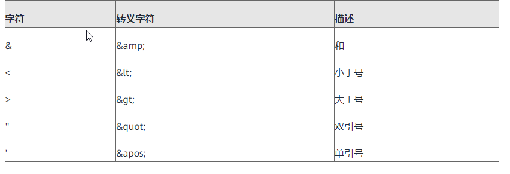

利用CD来快速创建不解析区域：

```xml
<name><![CDATA[hh<><><><>hh]]></name>
```

解析：

​	JDK为我们内置了名叫==**org.w3c**==的XML解析库，来帮助我们对**XML文件内容**进行解析

```java
public static void main(String[] args) {
    // 创建DocumentBuilderFactory对象
    DocumentBuilderFactory factory = DocumentBuilderFactory.newInstance();
    // 创建DocumentBuilder对象
    try {
        DocumentBuilder builder = factory.newDocumentBuilder();
        Document d = builder.parse("file:day15_xml/test.xml");
        // 每一个标签都作为一个节点
        NodeList nodeList = d.getElementsByTagName("outer");  // 可能有很多个名字为test的标签
        Node rootNode = nodeList.item(0); // 获取首个

        NodeList childNodes = rootNode.getChildNodes(); // 一个节点下可能会有很多个节点，比如根节点下就囊括了所有的节点
        //节点可以是一个带有内容的标签（它内部就还有子节点），也可以是一段文本内容

        for (int i = 0; i < childNodes.getLength(); i++) {
            Node child = childNodes.item(i);
            if (child.getNodeType() == Node.ELEMENT_NODE)  //过滤换行符之类的内容，因为它们都被认为是一个文本节点
                System.out.println(child.getNodeName() + "：" + child.getFirstChild().getNodeValue());
            // 输出节点名称，也就是标签名称，以及标签内部的文本（内部的内容都是子节点，所以要获取内部的节点）
        }
    } catch (Exception e) {
        e.printStackTrace();
    }
}
```


## 18 java新特性


### java8

#### 1 lambda表达式

- `([参数类型 参数名称，].....)->{代码}`
- 和匿名内部类不同，lambda只支持接口，不支持抽象类
- 接口内部有且只有一个抽象方法(可以有多个方法，但必须保证其他方法又默认实现，必须留一个抽象方法出来)

```java
public class ThreadDemo {
    public static void main(String[] args) {
        new Thread(()->{
            System.out.println("hello");
        }).start();
    }
}
```

class文件是一个完整的匿名内部类：

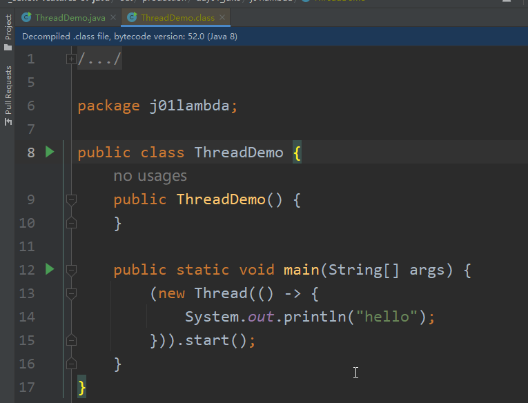

> 但它的底层并不只是匿名内部类这种简短的写法这么简单：
>
> ​	因为当不用lambda时，打开class文件夹有两个文件
>
> 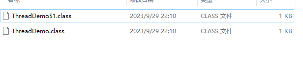
>
> 这里lambda的形式会给Runnable接口一个方法体来实现其run方法，这样就只有一个class文件


##### 1.1 @FunctionalInterface 函数式接口

​	这个注解会注明可以用lambda方法，当然对应的接口必须符合一个抽象方法的条件


##### 1.2 简化

```java
Test test0 = (int i)->{return ""+i;};
```

- 方法参数类型可以省略

```java
Test test0 = (i)->{return ""+i;};
```

- 只有一个参数时不用加小括号

```java
Test test0 = i->{return ""+i;};
```

- 返回语句仅有一行时，无需花括号

```java
Test t2 = i-> ""+i;
```


##### 1.3 lambda的方法体实现

如果实现类里面有一个静态方法匹配接口中的抽象方法的返回值和参数列表

- 我们就可以把他作为返回值

```java
Test t3 = (i)->impl(i);
```

- 或者说，使用类名::方法名称的形式来直接引用一个已有的方法作为实现

```java
Test t4 = ThreadDemo::impl;
```


#### 2 optional


### jdk9

#### 1 模块化


#### 2 jshell

```bash
C:\Users\Dell>jshell
|  欢迎使用 JShell -- 版本 17.0.7
|  要大致了解该版本, 请键入: /help intro

jshell> /help intro
|
|                                   intro
|                                   =====
|
|  使用 jshell 工具可以执行 Java 代码，从而立即获取结果。
|  您可以输入 Java 定义（变量、方法、类等等），例如：int x = 8
|  或 Java 表达式，例如：x + x
|  或 Java 语句或导入。
|  这些小块的 Java 代码称为“片段”。
|
|  这些 jshell 工具命令还可以让您了解和
|  控制您正在执行的操作，例如：/list
|
|  有关命令的列表，请执行：/help

jshell> /help
|  键入 Java 语言表达式, 语句或声明。
|  或者键入以下命令之一:
|  /list [<名称或 id>|-all|-start]
|       列出您键入的源
|  /edit <名称或 id>
|       编辑源条目
|  /drop <名称或 id>
|       删除源条目
|  /save [-all|-history|-start] <文件>
|       将片段源保存到文件
|  /open <file>
|       打开文件作为源输入
|  /vars [<名称或 id>|-all|-start]
|       列出已声明变量及其值
|  /methods [<名称或 id>|-all|-start]
|       列出已声明方法及其签名
|  /types [<名称或 id>|-all|-start]
|       列出类型声明
|  /imports
|       列出导入的项
|  /exit [<integer-expression-snippet>]
|       退出 jshell 工具
|  /env [-class-path <路径>] [-module-path <路径>] [-add-modules <模块>] ...
|       查看或更改评估上下文
|  /reset [-class-path <路径>] [-module-path <路径>] [-add-modules <模块>]...
|       重置 jshell 工具
|  /reload [-restore] [-quiet] [-class-path <路径>] [-module-path <路径>]...
|       重置和重放相关历史记录 -- 当前历史记录或上一个历史记录 (-restore)
|  /history [-all]
|       您键入的内容的历史记录
|  /help [<command>|<subject>]
|       获取有关使用 jshell 工具的信息
|  /set editor|start|feedback|mode|prompt|truncation|format ...
|       设置配置信息
|  /? [<command>|<subject>]
|       获取有关使用 jshell 工具的信息
|  /!
|       重新运行上一个片段 -- 请参阅 /help rerun
|  /<id>
|       按 ID 或 ID 范围重新运行片段 -- 参见 /help rerun
|  /-<n>
|       重新运行以前的第 n 个片段 -- 请参阅 /help rerun
|
|  有关详细信息, 请键入 '/help', 后跟
|  命令或主题的名称。
|  例如 '/help /list' 或 '/help intro'。主题:
|
|  intro
|       jshell 工具的简介
|  keys
|       类似 readline 的输入编辑的说明
|  id
|       片段 ID 以及如何使用它们的说明
|  shortcuts
|       片段和命令输入提示, 信息访问以及
|       自动代码生成的按键说明
|  context
|       /env /reload 和 /reset 的评估上下文选项的说明
|  rerun
|       重新评估以前输入片段的方法的说明

jshell> int x = 8
x ==> 8

jshell> int y = 20
y ==> 20

jshell> int c = x+y
c ==> 28

jshell> public int min(int a,int b) {
   ...>     retrun a<b?a:b;
   ...> }
|  错误:
|  需要';'
|      retrun a<b?a:b;
|              ^
|  错误:
|  需要>
|      retrun a<b?a:b;
|                ^

jshell> public int min(int a,int b) {
   ...>     return a<b?a:b;
   ...> }
|  已创建 方法 min(int,int)

jshell> /methods
|    int min(int,int)

jshell> c = min(x,y)
c ==> 8

jshell> /exit
```


#### 3 接口中的private方法

