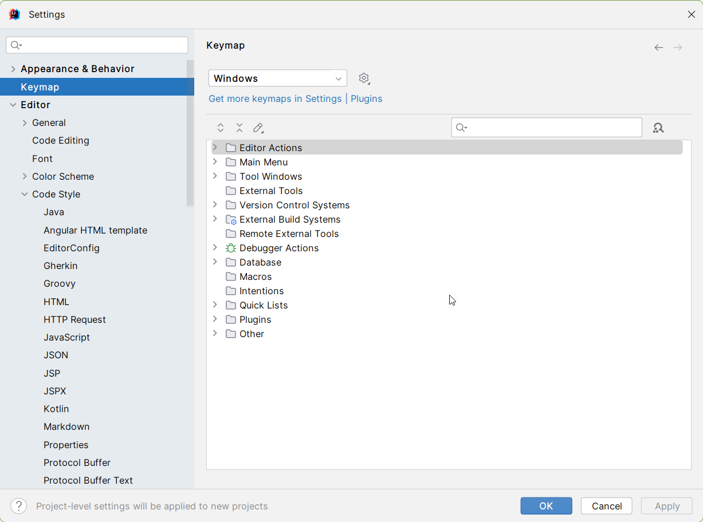

# javaSE

## 0 idea快捷键

ctrl+clt+t   if、for、try快捷键

alt + F8 评估表达式

ctrl+alt+shift+u 查看类的关系图


## 1 jdk

jdk 1.8`.;%JAVA_HOME%\lib;%JAVA_HOME%\lib\dt.jar;%JAVA_HOME%\lib\tools.jar`

jdk 17 `.;%JAVA_HOME%\lib;%JRE_HOME%\lib`

导出jre jdk目录下 `bin\jlink.exe --module-path jmods --add-modules java.desktop --output jre`


## 2 idea配置


### 2.1 常用设置

#### 鼠标滚轮修改字体大小


#### 鼠标悬浮提示


#### 自动导包功能


#### 行号、分割线


#### 忽略大小写


IntelliJ IDEA 的代码提示和补充功能有一个特性：区分大小写。如上图标注所示，默认就是 First letter 区分大小写的。
区分大小写的情况是这样的：比如我们在 Java 代码文件中输入 stringBuffer，IntelliJ IDEA 默认是不会帮我们提示或是代码补充的，但是如果我们输入StringBuffer 就可以进行代码提示和补充。
如果想不区分大小写的话，改为 all..选项即可

#### 取消单行显示tab


multiple rows 多行显示

#### 修改代码中注解的字体颜色


- Doc Comment – Text：修改文档注释的字体颜色
- Block comment：修改多行注释的字体颜色
- Line comment：修改单行注释的字体颜色

#### 类头的文档注释信息


```java
/**
 * @author jocularchao
 * @date ${YEAR}-${MONTH}-${DAY} ${TIME}
*/
```

#### 项目文件编码


Transparent native-to-ascii conversion 主要用于转换 ascii，一般都要勾选，不然 Properties 文件中的注释显示的都不会是中文

#### 自动编译


#### 注释格式

##### java注释优化代码格式前空格格式


##### html/xml 注释优化代码注释前空格格式


#### 快捷键设置



#### 去掉idea自带的.impl文件，以及.idea文件夹


### 2.2 maven设置


## 11 泛型

​	为了统计学生成绩，要求设计一个Score对象，包括课程名称、课程号、课程成绩，但是成绩分为两种，一种是以优秀、良好、合格来作为成绩，还有一种就是 `60.0、75.5、92.5` 这样的数字分数，可能高等数学这门课是以数字成绩进行结算，而计算机网络实验这门课是以等级进行结算，这两种分数类型都有可能出现，那么现在该如何去设计这样的一个Score类呢？

现在的问题就是，成绩可能是`String`类型，也可能是`Integer`类型，如何才能很好的去存可能出现的两种类型呢？

```java
public class Score {
    String name;
    String id;
    Object value;  //因为Object是所有类型的父类，因此既可以存放Integer也能存放String

  	public Score(String name, String id, Object value) {
        this.name = name;
        this.id = id;
        this.value = value;
    }
}
```

以上的方法虽然很好地解决了多种类型存储问题，但是Object类型在编译阶段并不具有良好的类型判断能力，很容易出现以下的情况：

```java
public static void main(String[] args) {

    Score score = new Score("数据结构与算法基础", "EP074512", "优秀");  //是String类型的

    ...

    Integer number = (Integer) score.score;  //获取成绩需要进行强制类型转换，虽然并不是一开始的类型，但是编译不会报错
}
```

使用Object类型作为引用，对于使用者来说，由于是Object类型，所以说并不能直接判断存储的类型到底是String还是Integer，取值只能进行强制类型转换，显然无法在编译期确定类型是否安全，项目中代码量非常之大，进行类型比较又会导致额外的开销和增加代码量，如果不经比较就很容易出现类型转换异常，代码的健壮性有所欠缺

所以说这种解决办法虽然可行，但并不是最好的方案。

为了解决以上问题，JDK 5新增了泛型，它能够在编译阶段检查类型安全，大大提升开发效率。

### 泛型类

​	泛型其实就一个待定类型，我们可以使用一个特殊的名字表示泛型，泛型在定义时并不明确是什么类型，而是需要到使用时才会确定对应的泛型类型。

我们可以将一个类定义为一个泛型类：

```java
public class Score<T> {   //泛型类需要使用<>，我们需要在里面添加1 - N个类型变量
    String name;
    String id;
    T value;   //T会根据使用时提供的类型自动变成对应类型

    public Score(String name, String id, T value) {   //这里T可以是任何类型，但是一旦确定，那么就不能修改了
        this.name = name;
        this.id = id;
        this.value = value;
    }
}
```

我们来看看这是如何使用的：

```java
    public static void main(String[] args) {
        //一旦类型确定，泛型就变成对应的类型，但不影响其他对象
        Score<String> score = new Score<>("计算机网络", "20230825", "良好");
        System.out.println(score.value);

        Score<Integer> score1 = new Score<>("高数", "20230824", 91);
        System.out.println(score1.value);
    }
```

> 1、泛型将数据类型的确定控制在了编译阶段，在编写代码的时候就能明确泛型的类型，如果类型不符合，将无法通过编译！因为是具体使用对象时才会明确具体类型，所以说静态方法中是不能用的
>
> 
>
> 2、对泛型不要用强转，**不多大必要**
>
> ```java
> public void test(S s){
>         String a = (String) s;
>     }
> ```
>
> 3、不能通过这个泛型变量去直接创建对象和对应的数组
>
> 
>
> 4、具体类型不同的泛型类变量，不能使用不同的变量进行接收
>
> 
>
> 5、可以用通配符`？`来让某个变量支持引用确定了任意类型的泛型，但若使用通配符，由于类型不确定，所以说具体类型同样会变成Object
>
> ```java
> Score<?> test = new Score<Integer>();
> test = new Score<String>();
> Object o = test.value;
> ```

### 泛型与多态

不只是类，包括接口、抽象类，都是可以支持泛型的：

```java
public interface Study<T> {
    T test();
}
```

当子类实现此接口时，我们可以选择在实现类明确泛型类型，或是继续使用此泛型让具体创建的对象来确定类型：

```java
public class Main {
    public static void main(String[] args) {
        A a = new A();
        Integer i = a.test();
    }

    static class A implements Study<Integer>{
        //在实现接口或是继承父类时，如果子类是一个普通类，那么可以直接明确对应类型
        @Override
        public Integer test() {
            return null;
        }
    }
    
        static class B<T> implements Study<T>{
        //或者让子类继续为一个泛型类，那么可以不用明确
        @Override
        public T test() {
            return null;
        }
    }
    
}
```

### 泛型方法

​	当某个方法（无论是是静态方法还是成员方法）需要接受的参数类型并不确定时，我们也可以使用泛型来表示：

```java
public class demo {
    public static void main(String[] args) {
        System.out.println(test("Hello World!"));
    }

    private static <T> T test(T t){
        //在返回值类型前添加<>并填写泛型变量表示这个是一个泛型方法
        return t;
    }

}
```

### 泛型的界限

​	只需要在泛型后面加上extends关键字即可指定上界

```java
    public static void main(String[] args) {
        System.out.println(test(5.0));
    }

    private static <T extends Number> T test(T t){
        //在返回值类型前添加<>并填写泛型变量表示这个是一个泛型方法
        return t;
    }
```

​	同样的，我们也可以用通配符  下界

```java
public static void main(String[] args) {
    Score<? extends Integer> score = new Score<>("数据结构与算法", "EP074512", 60);
}
```

### 类型擦除

泛型是如何实现的呢？ 程序编译之后的样子是什么样呢？


### 函数式接口


### 判空包装


## 12 集合

​	集合类其实就是为了更好地组织、管理和操作我们的数据而存在的，包括列表、集合、队列、映射等数据结构。

​	集合跟数组：

相同：

​	1.它们都是容器，都能容纳一组元素

不同：

1. 数组的大小是固定的，集合的大小是可变的
2. 数组可以存放基本数据类型，但集合只能存放对象
3. 数组存放的类型只能是一种，但集合可以有不同种类的元素

###  集合根接口

​	Java中已经帮我们将常用的集合类型都实现好了，我们只需要直接拿来用就行了

```java
package top.jocularchao.l01start;

import java.util.ArrayList;//集合类基本都是在java.util包下定义的

/**
 * Create with IntelliJ IDEA.
 *
 * @author JocularChao
 * @date 2023/8/25 21:31
 * @Description
 */
public class Demo {
    public static void main(String[] args) {
        ArrayList<String> list = new ArrayList<>();
        list.add("666");
    }
}

```

这里用到了ArrayList类，我们查看它的类关系图来进一步学习：


Collection接口就是集合的根接口，它定义了集合类的一些基本操作，源码分析：

```java
public interface Collection<E> extends Iterable<E> {
    //-------这些是查询相关的操作----------

   	//获取当前集合中的元素数量
    int size();

    //查看当前集合是否为空
    boolean isEmpty();

    //查询当前集合中是否包含某个元素
    boolean contains(Object o);

    //返回当前集合的迭代器，我们会在后面介绍
    Iterator<E> iterator();

    //将集合转换为数组的形式
    Object[] toArray();

    //支持泛型的数组转换，同上
    <T> T[] toArray(T[] a);

    //-------这些是修改相关的操作----------

    //向集合中添加元素，不同的集合类具体实现可能会对插入的元素有要求，
  	//这个操作并不是一定会添加成功，所以添加成功返回true，否则返回false
    boolean add(E e);

    //从集合中移除某个元素，同样的，移除成功返回true，否则false
    boolean remove(Object o);


    //-------这些是批量执行的操作----------

    //查询当前集合是否包含给定集合中所有的元素
  	//从数学角度来说，就是看给定集合是不是当前集合的子集
    boolean containsAll(Collection<?> c);

    //添加给定集合中所有的元素
  	//从数学角度来说，就是将当前集合变成当前集合与给定集合的并集
  	//添加成功返回true，否则返回false
    boolean addAll(Collection<? extends E> c);

    //移除给定集合中出现的所有元素，如果某个元素在当前集合中不存在，那么忽略这个元素
  	//从数学角度来说，就是求当前集合与给定集合的差集
  	//移除成功返回true，否则false
    boolean removeAll(Collection<?> c);

    //Java8新增方法，根据给定的Predicate条件进行元素移除操作
    default boolean removeIf(Predicate<? super E> filter) {
        Objects.requireNonNull(filter);
        boolean removed = false;
        final Iterator<E> each = iterator();   //这里用到了迭代器，我们会在后面进行介绍
        while (each.hasNext()) {
            if (filter.test(each.next())) {
                each.remove();
                removed = true;
            }
        }
        return removed;
    }

    //只保留当前集合中在给定集合中出现的元素，其他元素一律移除
  	//从数学角度来说，就是求当前集合与给定集合的交集
  	//移除成功返回true，否则false
    boolean retainAll(Collection<?> c);

    //清空整个集合，删除所有元素
    void clear();


    //-------这些是比较以及哈希计算相关的操作----------

    //判断两个集合是否相等
    boolean equals(Object o);

    //计算当前整个集合对象的哈希值
    int hashCode();

    //与迭代器作用相同，但是是并行执行的，我们会在下一章多线程部分中进行介绍
    @Override
    default Spliterator<E> spliterator() {
        return Spliterators.spliterator(this, 0);
    }

    //生成当前集合的流，我们会在后面进行讲解
    default Stream<E> stream() {
        return StreamSupport.stream(spliterator(), false);
    }

    //生成当前集合的并行流，我们会在下一章多线程部分中进行介绍
    default Stream<E> parallelStream() {
        return StreamSupport.stream(spliterator(), true);
    }
}
```

### List接口

​	List列表（线性表），线性表支持随机访问，相比之前的Collection接口定义，功能还会更多一些。

List是集合类型的一个分支，它的主要特性有：

* 是一个有序的集合，插入元素默认是插入到尾部，按顺序从前往后存放，每个元素都有一个自己的下标位置
* 列表中允许存在重复元素

在List接口中，定义了列表类型需要支持的全部操作，List直接继承自前面介绍的Collection接口，其中很多地方重新定义了一次Collection接口中定义的方法，这样做是为了更加明确方法的具体功能，当然，为了直观，我们这里就省略掉：

```java
//List是一个有序的集合类，每个元素都有一个自己的下标位置
//List中可插入重复元素
//针对于这些特性，扩展了Collection接口中一些额外的操作
public interface List<E> extends Collection<E> {
    ...
   	
    //将给定集合中所有元素插入到当前结合的给定位置上（后面的元素就被挤到后面去了，跟我们之前顺序表的插入是一样的）
    boolean addAll(int index, Collection<? extends E> c);

    ...

   	//Java 8新增方法，可以对列表中每个元素都进行处理，并将元素替换为处理之后的结果
    default void replaceAll(UnaryOperator<E> operator) {
        Objects.requireNonNull(operator);
        final ListIterator<E> li = this.listIterator();  //这里同样用到了迭代器
        while (li.hasNext()) {
            li.set(operator.apply(li.next()));
        }
    }

    //对当前集合按照给定的规则进行排序操作，这里同样只需要一个Comparator就行了
    @SuppressWarnings({"unchecked", "rawtypes"})
    default void sort(Comparator<? super E> c) {
        Object[] a = this.toArray();
        Arrays.sort(a, (Comparator) c);
        ListIterator<E> i = this.listIterator();
        for (Object e : a) {
            i.next();
            i.set((E) e);
        }
    }

    ...

    //-------- 这些是List中独特的位置直接访问操作 --------

   	//获取对应下标位置上的元素
    E get(int index);

    //直接将对应位置上的元素替换为给定元素
    E set(int index, E element);

    //在指定位置上插入元素，就跟我们之前的顺序表插入是一样的
    void add(int index, E element);

    //移除指定位置上的元素
    E remove(int index);


    //------- 这些是List中独特的搜索操作 -------

    //查询某个元素在当前列表中的第一次出现的下标位置
    int indexOf(Object o);

    //查询某个元素在当前列表中的最后一次出现的下标位置
    int lastIndexOf(Object o);


    //------- 这些是List的专用迭代器 -------

    //迭代器我们会在下一个部分讲解
    ListIterator<E> listIterator();

    //迭代器我们会在下一个部分讲解
    ListIterator<E> listIterator(int index);

    //------- 这些是List的特殊转换 -------

    //返回当前集合在指定范围内的子集
    List<E> subList(int fromIndex, int toIndex);

    ...
}
```


#### 集合的使用

一般的，我们要使用一个集合类，我们就会使用接口的引用：

```java
List<String> list3 = new ArrayList<>();
```

使用接口的引用来操作具体的集合类实现，是为了方便日后如果我们想要更换不同的集合类实现，而且接口中本身就已经定义了主要的方法，所以说没必要直接用实现类

集合类是支持嵌套使用的，一个集合中可以存放多个集合，套娃:

```java
public static void main(String[] args) {
    List<List<String>> list = new LinkedList<>();
    list.add(new LinkedList<>());   //集合中的每一个元素就是一个集合，这个套娃是可以一直套下去的
    System.out.println(list.get(0).isEmpty());
}
```

在Arrays工具类中，我们可以快速生成一个只读的List：

```java
public static void main(String[] args) {
    List<String> list = Arrays.asList("A", "B", "C");   //非常方便
    System.out.println(list);
}
```

> 这个生成的List是只读的，不能进行修改操作，只能使用获取内容相关的方法，否则抛出 UnsupportedOperationException 异常。要生成正常使用的，我们可以将这个只读的列表作为参数传入：
>
> ```java
> public static void main(String[] args) {
>     List<String> list = new ArrayList<>(Arrays.asList("A", "B", "C"));
>     System.out.println(list);
> }
> ```
>

当然，也可以利用静态代码块：

```java
public static void main(String[] args) {
    List<String> list = new ArrayList<String>() {{   //使用匿名内部类（匿名内部类在Java8无法使用钻石运算符，但是之后的版本可以）
            add("A");
            add("B");
            add("C");
    }};
    System.out.println(list);
}
```

#### ArrayList

​	首先ArrayList，它的底层是用数组实现的，内部维护的是一个**可动态进行扩容**的数组，也就是我们之前所说的顺序表。

在List接口中，扩展了大量列表支持的操作，其中最突出的就是直接根据下标位置进行的增删改查操作。而在ArrayList中，底层就是采用数组实现的，跟我们之前的顺序表思路差不多：

```java
public class ArrayList<E> extends AbstractList<E>
        implements List<E>, RandomAccess, Cloneable, java.io.Serializable
{
		
    //默认的数组容量
    private static final int DEFAULT_CAPACITY = 10;

    ...

    //存放数据的底层数组，这里的transient关键字我们会在后面I/O中介绍用途
    transient Object[] elementData;

    //记录当前数组元素数的
    private int size;

   	//这是ArrayList的其中一个构造方法
    public ArrayList(int initialCapacity) {
        if (initialCapacity > 0) {
            this.elementData = new Object[initialCapacity];   //根据初始化大小，创建当前列表
        } else if (initialCapacity == 0) {
            this.elementData = EMPTY_ELEMENTDATA;
        } else {
            throw new IllegalArgumentException("Illegal Capacity: "+
                                               initialCapacity);
        }
    }
  
  	...
      
   	public boolean add(E e) {
        ensureCapacityInternal(size + 1);  // 这里会判断容量是否充足，不充足需要扩容
        elementData[size++] = e;
        return true;
    }
  	
  	...
    
    //默认的列表最大长度为Integer.MAX_VALUE - 8
    //JVM都C++实现中，在数组的对象头中有一个_length字段，用于记录数组的长
    //度，所以这个8就是存了数组_length字段（这个只做了解就行）
		private static final int MAX_ARRAY_SIZE = Integer.MAX_VALUE - 8;
  	
  	private void grow(int minCapacity) {
        int oldCapacity = elementData.length;
        int newCapacity = oldCapacity + (oldCapacity >> 1);   //扩容规则跟我们之前的是一样的，也是1.5倍
        if (newCapacity - minCapacity < 0)    //要是扩容之后的大小还没最小的大小大，那么直接扩容到最小的大小
            newCapacity = minCapacity;
        if (newCapacity - MAX_ARRAY_SIZE > 0)   //要是扩容之后比最大的大小还大，需要进行大小限制
            newCapacity = hugeCapacity(minCapacity);  //调整为限制的大小
        elementData = Arrays.copyOf(elementData, newCapacity);   //使用copyOf快速将内容拷贝到扩容后的新数组中并设定为新的elementData底层数组
    }
}
```

> 注意：
>
> 1、注意传参问题，要是传入的是基本类型，但集合的类型是包装类，那就需要转换一下
>
> ```java
> ArrayList<Integer> list1 = new ArrayList<>();
> list1.add(20);
> list1.remove((Integer) 20);
> ```
>
> 2、即使传入的是两个不同的对象，但如果两个对象的equals方法判断相等，那依旧看作是一个对象
>
> ```java
> ArrayList<Integer> list2 = new ArrayList<>();
> list2.add(new Integer(30));
> list2.remove(new Integer(30));
> ```
>
> 这里的remove源码：
>
> ```java
>     public boolean remove(Object o) {
>         if (o == null) {
>             for (int index = 0; index < size; index++)
>                 if (elementData[index] == null) {
>                     fastRemove(index);
>                     return true;
>                 }
>         } else {
>             for (int index = 0; index < size; index++)
>                 if (o.equals(elementData[index])) {
>                     fastRemove(index);
>                     return true;
>                 }
>         }
>         return false;
>     }
> ```
>

#### LinkedList

​	LinkedList同样是List的实现类，只不过它是采用的链式实现，它是一个双向链表，也就是同时保存两个方向：

```java
public class LinkedList<E>
    extends AbstractSequentialList<E>
    implements List<E>, Deque<E>, Cloneable, java.io.Serializable
{
    transient int size = 0;

    //引用首结点
    transient Node<E> first;

    //引用尾结点
    transient Node<E> last;

    //构造方法，很简单，直接创建就行了
    public LinkedList() {
    }
  
  	...
      
    private static class Node<E> {   //内部使用的结点类
        E item;
        Node<E> next;   //不仅保存指向下一个结点的引用，还保存指向上一个结点的引用
        Node<E> prev;

        Node(Node<E> prev, E element, Node<E> next) {
            this.item = element;
            this.next = next;
            this.prev = prev;
        }
    }
  
    ...
}
```


### 迭代器

​	实际上我们的集合类都是支持foreach语法

```java
public class IteratorDemo1 {
    public static void main(String[] args) {
        List<String> list = new LinkedList<>(Arrays.asList("A", "B", "C"));
        /*Iterator<String> iterator = list.iterator();
        while (iterator.hasNext()){
            System.out.println(iterator.next());
        }*/

        for (String s : list) {
            System.out.println(s);
        }
    }

}
```

但实际上是语法糖，我们打开编辑文件，发现还是通过Iterator迭代器实现：

```java
public class IteratorDemo1 {
    public IteratorDemo1() {
    }

    public static void main(String[] args) {
        List<String> list = new LinkedList(Arrays.asList("A", "B", "C"));
        Iterator var2 = list.iterator();

        while(var2.hasNext()) {
            String s = (String)var2.next();
            System.out.println(s);
        }
    }
}
```

#### 源码剖析

Iterator来自Collection集合跟接口的父类Iterable接口：

```java
public interface Iterator<E> {
	//看看是否还有下一个元素
    boolean hasNext();

    //遍历当前元素，并将下一个元素作为待遍历元素
    E next();

	//移除上一个被遍历的元素（某些集合不支持这种操作）
    default void remove() {
        throw new UnsupportedOperationException("remove");
    }
    //对剩下的元素进行自定义遍历操作
    default void forEachRemaining(Consumer<? super E> action) {
        Objects.requireNonNull(action);
        while (hasNext())
            action.accept(next());
    }
}
```

运行机制：


ArrayList和LinkedList各自的实现方式不同

ArrayList就是直接按下标访问:

```java
public E next() {
  	.....
    cursor = i + 1;  //移动指针
    return (E) elementData[lastRet = i];  //直接返回指针所指的元素
}
```

LinkedList就是不断向后寻找结点：

```java
public E next() {
    ...
    next = next.next;   //向后继续寻找结点
    nextIndex++;
    return lastReturned.item;  //返回结点内部存放的元素
}
```

因为这种设计，Iterator就可以直接使用而不用在意集合如何实现

> 注意
>
> ​	迭代器的使用是一次性的，用了之后就不能用了，如果需要再次进行遍历操作，那么需要重新生成一个迭代器对象。
>
> ​	为了简便，我们可以直接使用`foreach`语法来快速遍历集合类。

#### 新特性

java8 提供了一个Lambda表达式的forEach方法，这个方法接受一个Consumer，也就是对遍历的每一个元素进行操作：

```java
public static void main(String[] args) {
    List<String> list = Arrays.asList("A", "B", "C");
    list.forEach(System.out::println);
}
```

因为forEach方法内部本质上也是迭代器在处理，这个方法是在Iterable接口中定义的：

```java
default void forEach(Consumer<? super T> action) {
    Objects.requireNonNull(action);
    for (T t : this) {	//foreach语法遍历每一个元素
        action.accept(t);	//调用Consumer的accept来对每一个元素进行消费
    }
}
```

#### Iterable接口


```java
//注意这个接口是集合接口的父接口，不要跟之前的迭代器接口搞混了
public interface Iterable<T> {
    //生成当前集合的迭代器，在Collection接口中重复定义了一次
    Iterator<T> iterator();

    //Java8新增方法，因为是在顶层接口中定义的，因此所有的集合类都有这个方法
    default void forEach(Consumer<? super T> action) {
        Objects.requireNonNull(action);
        for (T t : this) {
            action.accept(t);
        }
    }

    //这个方法会在多线程部分中进行介绍，暂时不做讲解
    default Spliterator<T> spliterator() {
        return Spliterators.spliteratorUnknownSize(iterator(), 0);
    }
}
```

#### ListIterator

这个迭代器是针对于List的强化版本，增加了更多方便的操作，因为List是有序集合，所以它支持两种方向的遍历操作，不仅能从前向后，也可以从后向前：

```java
public interface ListIterator<E> extends Iterator<E> {
    //原本就有的
    boolean hasNext();

    //原本就有的
    E next();

    //查看前面是否有已经遍历的元素
    boolean hasPrevious();

    //跟next相反，这里是倒着往回遍历
    E previous();

    //返回下一个待遍历元素的下标
    int nextIndex();

    //返回上一个已遍历元素的下标
    int previousIndex();

    //原本就有的
    void remove();

    //将上一个已遍历元素修改为新的元素
    void set(E e);

    //在遍历过程中，插入新的元素到当前待遍历元素之前
    void add(E e);
}
```

### Queue和Deque

LinkedList除了可以直接当做列表使用之外，还可以当做其他的数据结构使用，可以看到它不 仅仅实现了List接口：

```java
public class LinkedList<E>
    extends AbstractSequentialList<E>
    implements List<E>, Deque<E>, Cloneable, java.io.Serializable
{
```


队列接口，它扩展了大量队列相关操作：

```java
public interface Queue<E> extends Collection<E> {
    //队列的添加操作，是在队尾进行插入（只不过List也是一样的，默认都是尾插）
  	//如果插入失败，会直接抛出异常
    boolean add(E e);

    //同样是添加操作，但是插入失败不会抛出异常
    boolean offer(E e);

    //移除队首元素，但是如果队列已经为空，那么会抛出异常
    E remove();

   	//同样是移除队首元素，但是如果队列为空，会返回null
    E poll();

    //仅获取队首元素，不进行出队操作，但是如果队列已经为空，那么会抛出异常
    E element();

    //同样是仅获取队首元素，但是如果队列为空，会返回null
    E peek();
}
```

因此，我们可以直接将一个LinkedList当作一个队列使用：

```java
public static void main(String[] args) {
    Queue<String> queue = new LinkedList<>();   //当做队列使用，还是很方便的
    queue.offer("AAA");
    queue.offer("BBB");
    System.out.println(queue.poll());
    System.out.println(queue.poll());
}
```

我们接着来看双端队列，实际上双端队列就是队列的升级版，我们一个普通的队列就是：


普通队列中从队尾入队，队首出队，而双端队列允许在队列的两端进行入队和出队操作：


利用这种特性，双端队列既可以当做普通队列使用，也可以当做栈来使用，我们来看看Java中是如何定义的Deque双端队列接口的：

```java
//在双端队列中，所有的操作都有分别对应队首和队尾的
public interface Deque<E> extends Queue<E> {
    //在队首进行插入操作
    void addFirst(E e);

    //在队尾进行插入操作
    void addLast(E e);
		
  	//不用多说了吧？
    boolean offerFirst(E e);
    boolean offerLast(E e);

    //在队首进行移除操作
    E removeFirst();

    //在队尾进行移除操作
    E removeLast();

    //不用多说了吧？
    E pollFirst();
    E pollLast();

    //获取队首元素
    E getFirst();

    //获取队尾元素
    E getLast();

		//不用多说了吧？
    E peekFirst();
    E peekLast();

    //从队列中删除第一个出现的指定元素
    boolean removeFirstOccurrence(Object o);

    //从队列中删除最后一个出现的指定元素
    boolean removeLastOccurrence(Object o);

    // *** 队列中继承下来的方法操作是一样的，这里就不列出了 ***

    ...

    // *** 栈相关操作已经帮助我们定义好了 ***

    //将元素推向栈顶
    void push(E e);

    //将元素从栈顶出栈
    E pop();


    // *** 集合类中继承的方法这里也不多种介绍了 ***

    ...

    //生成反向迭代器，这个迭代器也是单向的，但是是next方法是从后往前进行遍历的
    Iterator<E> descendingIterator();

}
```

我们可以直接当做栈来进行使用：

```java
public static void main(String[] args) {
    Deque<String> deque = new LinkedList<>();
    deque.push("AAA");
    deque.push("BBB");
    System.out.println(deque.pop());
    System.out.println(deque.pop());
}
```

正向迭代器和反向迭代器：

```java
public static void main(String[] args) {
    Deque<String> deque = new LinkedList<>();
    deque.addLast("AAA");
    deque.addLast("BBB");
    Iterator<String> descendingIterator = deque.descendingIterator();
    System.out.println(descendingIterator.next());

    Iterator<String> iterator = deque.iterator();
    System.out.println(iterator.next());
}
```
当然，除了LinkedList实现了队列接口之外，还有其他的实现类，但是并不是很常用，这里做了解就行了：

```java
public static void main(String[] args) {
    Deque<String> deque = new ArrayDeque<>();   //数组实现的栈和队列
    Queue<String> queue = new PriorityQueue<>();  //优先级队列
}
```

这里需要介绍一下优先级队列，优先级队列可以根据每一个元素的优先级，对出队顺序进行调整，默认情况按照自然顺序：

```java
public static void main(String[] args) {
    Queue<Integer> queue = new PriorityQueue<>();
    queue.offer(10);
    queue.offer(4);
    queue.offer(5);
    System.out.println(queue.poll());
    System.out.println(queue.poll());
    System.out.println(queue.poll());
}
```

### Set集合

我们发现接口中定义的方法都是Collection中直接继承的，因此，Set支持的功能其实也就和Collection中定义的差不多，只不过：

- 不允许出现重复元素
- 不支持随机访问（不允许通过下标访问）

```java
public interface Set<E> extends Collection<E> {
    // Set集合中基本都是从Collection直接继承过来的方法，只不过对这些方法有更加特殊的定义
    int size();
    boolean isEmpty();
    boolean contains(Object o);
    Iterator<E> iterator();
    Object[] toArray();
    <T> T[] toArray(T[] a);

    //添加元素只有在当前Set集合中不存在此元素时才会成功，如果插入重复元素，那么会失败
    boolean add(E e);

    //这个同样是删除指定元素
    boolean remove(Object o);

    boolean containsAll(Collection<?> c);

    //同样是只能插入那些不重复的元素
    boolean addAll(Collection<? extends E> c);
  
    boolean retainAll(Collection<?> c);
    boolean removeAll(Collection<?> c);
    void clear();
    boolean equals(Object o);
    int hashCode();

    //这个方法我们同样会放到多线程中进行介绍
    @Override
    default Spliterator<E> spliterator() {
        return Spliterators.spliterator(this, Spliterator.DISTINCT);
    }
}
```

由于底层采用哈希表实现，所以说无法维持插入元素的顺序：

```java
public static void main(String[] args) {
    Set<String> set = new HashSet<>();
    set.addAll(Arrays.asList("A", "0", "-", "+"));
    System.out.println(set);
}
```


## 15 xml

​	xml语言最初是用于数据的存储和传输

```xml
<?xml version="1.0" encoding="utf-8" ?>
<outer>
    <name>索隆</name>
    <desc>三刀流</desc>
    <inner type="1">
        <age>22</age>
        <sex>男</sex>
    </inner>
</outer>
```

规范：

- 必须有一个根节点，将子节点包起来。outer
- 可以但不必须包含头声明<?xml >
- 标签成对出现，不能交叉嵌套
- 区分大小写
- 标签中可以有属性

注释：

```xml
<!--    -->
```

xml中转义字符：


利用CD来快速创建不解析区域：

```xml
<name><![CDATA[hh<><><><>hh]]></name>
```

解析：

​	JDK为我们内置了名叫==**org.w3c**==的XML解析库，来帮助我们对**XML文件内容**进行解析

```java
public static void main(String[] args) {
    // 创建DocumentBuilderFactory对象
    DocumentBuilderFactory factory = DocumentBuilderFactory.newInstance();
    // 创建DocumentBuilder对象
    try {
        DocumentBuilder builder = factory.newDocumentBuilder();
        Document d = builder.parse("file:day15_xml/test.xml");
        // 每一个标签都作为一个节点
        NodeList nodeList = d.getElementsByTagName("outer");  // 可能有很多个名字为test的标签
        Node rootNode = nodeList.item(0); // 获取首个

        NodeList childNodes = rootNode.getChildNodes(); // 一个节点下可能会有很多个节点，比如根节点下就囊括了所有的节点
        //节点可以是一个带有内容的标签（它内部就还有子节点），也可以是一段文本内容

        for (int i = 0; i < childNodes.getLength(); i++) {
            Node child = childNodes.item(i);
            if (child.getNodeType() == Node.ELEMENT_NODE)  //过滤换行符之类的内容，因为它们都被认为是一个文本节点
                System.out.println(child.getNodeName() + "：" + child.getFirstChild().getNodeValue());
            // 输出节点名称，也就是标签名称，以及标签内部的文本（内部的内容都是子节点，所以要获取内部的节点）
        }
    } catch (Exception e) {
        e.printStackTrace();
    }
}
```


## 18 java新特性


### java8

#### 1 lambda表达式

- `([参数类型 参数名称，].....)->{代码}`
- 和匿名内部类不同，lambda只支持接口，不支持抽象类
- 接口内部有且只有一个抽象方法(可以有多个方法，但必须保证其他方法又默认实现，必须留一个抽象方法出来)

```java
public class ThreadDemo {
    public static void main(String[] args) {
        new Thread(()->{
            System.out.println("hello");
        }).start();
    }
}
```

class文件是一个完整的匿名内部类：


> 但它的底层并不只是匿名内部类这种简短的写法这么简单：
>
> ​	因为当不用lambda时，打开class文件夹有两个文件
>
> 
>
> 这里lambda的形式会给Runnable接口一个方法体来实现其run方法，这样就只有一个class文件


##### 1.1 @FunctionalInterface 函数式接口

​	这个注解会注明可以用lambda方法，当然对应的接口必须符合一个抽象方法的条件


##### 1.2 简化

```java
Test test0 = (int i)->{return ""+i;};
```

- 方法参数类型可以省略

```java
Test test0 = (i)->{return ""+i;};
```

- 只有一个参数时不用加小括号

```java
Test test0 = i->{return ""+i;};
```

- 返回语句仅有一行时，无需花括号

```java
Test t2 = i-> ""+i;
```


##### 1.3 lambda的方法体实现

如果实现类里面有一个静态方法匹配接口中的抽象方法的返回值和参数列表

- 我们就可以把他作为返回值

```java
Test t3 = (i)->impl(i);
```

- 或者说，使用类名::方法名称的形式来直接引用一个已有的方法作为实现

```java
Test t4 = ThreadDemo::impl;
```


#### 2 optional

比如要把传入的字符串转换成小写的，原本我们写应该是：

```java
System.out.println(str.toLowerCase());
```

在加上非空判断就是

```java
public static void strToLower(String str) {
        //这里要做非空判断
        if (str!= null)
            System.out.println(str.toLowerCase());
        
    }
```

但Optional给了我们新的选择

```java
public static void strToLower(String str) {
        //这里要做非空判断
        /*if (str!= null)
            System.out.println(str.toLowerCase());
        */
        
    //Optional 的 of方法来接收变量，ofNullable（）来接收非空变量
        Optional.ofNullable(str)
                .ifPresent(s -> {
                    System.out.println(s.toLowerCase());
                });
    }
```


### jdk9

#### 1 模块化


在每个模块设定pom版本为jdk9、新建模块文件


在module-b 导入module-a的依赖


但虽然导入了module-a的依赖但module-b仍然用不了module-a的包，这就是jdk9的问题，必须在新建的模块文件module-info.java 中进行导出导入操作

module-a：

```java
open module module.a {
    //导出module-a给b
     exports com.test to module.b;

     //transitive 传递给依赖本模块的模块，b不导入logging就可以用了
     requires transitive java.logging;

    //打开test包与上面的打开模块重叠了，就是为了可以用反射
     //opens com.test;
    //使用Test接口
     uses com.test.Test;
}
```

module-b：

```java
module module.b {
    //module-b接收module-a
     requires module.a;

    //声明接口的实现
     provides com.test.Test with com.study.TestImpl;
}
```


#### 2 jshell

```bash
C:\Users\Dell>jshell
|  欢迎使用 JShell -- 版本 17.0.7
|  要大致了解该版本, 请键入: /help intro

jshell> /help intro
|
|                                   intro
|                                   =====
|
|  使用 jshell 工具可以执行 Java 代码，从而立即获取结果。
|  您可以输入 Java 定义（变量、方法、类等等），例如：int x = 8
|  或 Java 表达式，例如：x + x
|  或 Java 语句或导入。
|  这些小块的 Java 代码称为“片段”。
|
|  这些 jshell 工具命令还可以让您了解和
|  控制您正在执行的操作，例如：/list
|
|  有关命令的列表，请执行：/help

jshell> /help
|  键入 Java 语言表达式, 语句或声明。
|  或者键入以下命令之一:
|  /list [<名称或 id>|-all|-start]
|       列出您键入的源
|  /edit <名称或 id>
|       编辑源条目
|  /drop <名称或 id>
|       删除源条目
|  /save [-all|-history|-start] <文件>
|       将片段源保存到文件
|  /open <file>
|       打开文件作为源输入
|  /vars [<名称或 id>|-all|-start]
|       列出已声明变量及其值
|  /methods [<名称或 id>|-all|-start]
|       列出已声明方法及其签名
|  /types [<名称或 id>|-all|-start]
|       列出类型声明
|  /imports
|       列出导入的项
|  /exit [<integer-expression-snippet>]
|       退出 jshell 工具
|  /env [-class-path <路径>] [-module-path <路径>] [-add-modules <模块>] ...
|       查看或更改评估上下文
|  /reset [-class-path <路径>] [-module-path <路径>] [-add-modules <模块>]...
|       重置 jshell 工具
|  /reload [-restore] [-quiet] [-class-path <路径>] [-module-path <路径>]...
|       重置和重放相关历史记录 -- 当前历史记录或上一个历史记录 (-restore)
|  /history [-all]
|       您键入的内容的历史记录
|  /help [<command>|<subject>]
|       获取有关使用 jshell 工具的信息
|  /set editor|start|feedback|mode|prompt|truncation|format ...
|       设置配置信息
|  /? [<command>|<subject>]
|       获取有关使用 jshell 工具的信息
|  /!
|       重新运行上一个片段 -- 请参阅 /help rerun
|  /<id>
|       按 ID 或 ID 范围重新运行片段 -- 参见 /help rerun
|  /-<n>
|       重新运行以前的第 n 个片段 -- 请参阅 /help rerun
|
|  有关详细信息, 请键入 '/help', 后跟
|  命令或主题的名称。
|  例如 '/help /list' 或 '/help intro'。主题:
|
|  intro
|       jshell 工具的简介
|  keys
|       类似 readline 的输入编辑的说明
|  id
|       片段 ID 以及如何使用它们的说明
|  shortcuts
|       片段和命令输入提示, 信息访问以及
|       自动代码生成的按键说明
|  context
|       /env /reload 和 /reset 的评估上下文选项的说明
|  rerun
|       重新评估以前输入片段的方法的说明

jshell> int x = 8
x ==> 8

jshell> int y = 20
y ==> 20

jshell> int c = x+y
c ==> 28

jshell> public int min(int a,int b) {
   ...>     retrun a<b?a:b;
   ...> }
|  错误:
|  需要';'
|      retrun a<b?a:b;
|              ^
|  错误:
|  需要>
|      retrun a<b?a:b;
|                ^

jshell> public int min(int a,int b) {
   ...>     return a<b?a:b;
   ...> }
|  已创建 方法 min(int,int)

jshell> /methods
|    int min(int,int)

jshell> c = min(x,y)
c ==> 8

jshell> /exit
```


#### 3 接口中的private方法

jdk9后我们就可以定义接口的私有方法：

```java
public interface Test {

    default void test() {
        System.out.println("我是test方法默认实现");
    }

    //private
    private static void inner() {
        System.out.println("i'm interface's private method");
    }

    static void xx(){

    }
}
```

​	此私有方法必须提供方法体，因为权限为私有的，也只有这里能进行方法的具体实现，并且此方法只能被接口中的其他私有方法或是默认实现调用。

​	


#### 4 工厂方法


#### 5 改进的streamAPI


#### 6 其他新特性


### jdk10


### jdk11


### jdk12
